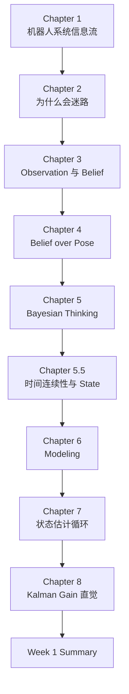
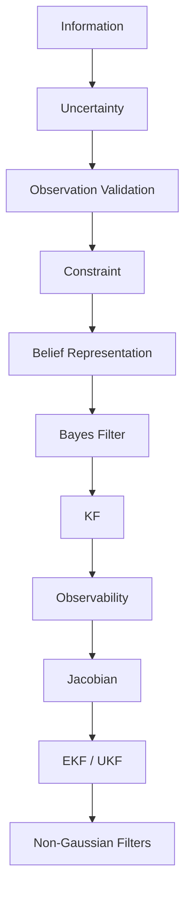

# SLAM 自学

同时定位与建图（SLAM）学习笔记入口。草稿与课程材料可直接放本目录；课程笔记整理规范见 [[.regulation/LearningNoteRules|LearningNoteRules]]。

## 课程

### Part I：Robot Foundations

| 笔记 | 说明 |
| --- | --- |
| [[Courses/Part I Robot Foundations/Week 1 Chapter 1|Week 1 Chapter 1：机器人到底是什么？]] | 建立机器人软件信息流：Sensor、Perception、Localization & Mapping、Planning、Control |
| [[Courses/Part I Robot Foundations/Week 1 Chapter 2|Week 1 Chapter 2：为什么机器人会迷路？]] | 从 Encoder 和 Odometry 误差引出 Localization |
| [[Courses/Part I Robot Foundations/Week 1 Chapter 3|Week 1 Chapter 3：如果机器人不能相信任何一个传感器，它到底应该相信谁？]] | 区分 Observation、Reality、Belief，进入 Information Fusion |
| [[Courses/Part I Robot Foundations/Week 1 Chapter 4|Week 1 Chapter 4：为什么机器人维护的是一个概率分布，而不是一个位置？]] | 理解 Belief over Pose，而不是单点 Pose |
| [[Courses/Part I Robot Foundations/Week 1 Chapter 5|Week 1 Chapter 5：贝叶斯思想到底是什么？]] | 用 Prior、Observation、Posterior 理解 Belief Update |
| [[Courses/Part I Robot Foundations/Week 1 Chapter 5.5|Week 1 Chapter 5.5：为什么机器人能够利用时间？]] | 新增章节：引入 State、Prediction、Temporal Consistency、Markov Assumption |
| [[Courses/Part I Robot Foundations/Week 1 Chapter 6|Week 1 Chapter 6：为什么机器人学本质上是一门建模的学科？]] | 理解 Model、State Design、Prediction / Correction |
| [[Courses/Part I Robot Foundations/Week 1 Chapter 7|Week 1 Chapter 7：如果世界上还没有 Kalman Filter，你会怎么设计一个机器人？]] | 从世界规律、Observation、Model 推导状态估计循环 |
| [[Courses/Part I Robot Foundations/Week 1 Chapter 8|Week 1 Chapter 8：如果世界上没有 Kalman Filter，我们能不能自己推导出来？]] | 从不确定性和信息增益理解 Kalman Gain |
| [[Courses/Part I Robot Foundations/Week 1 Summary|Week 1 Summary：课程总结与 Week 2 调整]] | 总结 Week 1 实际学习轨迹，并更新 Week 2 方向 |

### Part II：Probabilistic State Estimation

| 笔记 | 说明 |
| --- | --- |
| [[Courses/Part II Probabilistic State Estimation/Week 2 Chapter 9|Chapter 9：Information]] | 区分 Data、Observation 与 Information |
| [[Courses/Part II Probabilistic State Estimation/Week 2 Chapter 10|Chapter 10：Uncertainty]] | 区分 Error、Noise、Confidence 与 Uncertainty |
| [[Courses/Part II Probabilistic State Estimation/Week 2 Chapter 11|Chapter 11：Observation Validation]] | Innovation、Mahalanobis Gating 与 Data Association |
| [[Courses/Part II Probabilistic State Estimation/Week 2 Chapter 11.5|Chapter 11.5：Data to Constraint]] | 连接 Feature、Observation、Constraint 与估计后端 |
| [[Courses/Part II Probabilistic State Estimation/Week 2 Chapter 12|Chapter 12：Constraint]] | 从 Observation Model 到 Likelihood 与 Cost |
| [[Courses/Part II Probabilistic State Estimation/Week 2 Chapter 13|Chapter 13：Belief Representation]] | 分布、样本与参数化表示 |
| [[Courses/Part II Probabilistic State Estimation/Week 2 Chapter 14|Chapter 14：Gaussian]] | Mean、Variance、Covariance 与适用边界 |
| [[Courses/Part II Probabilistic State Estimation/Week 2 Chapter 15|Chapter 15：Bayes Filter]] | Prediction / Correction 的递归母框架 |
| [[Courses/Part II Probabilistic State Estimation/Week 2 Chapter 16|Chapter 16：Kalman Filter]] | 一维线性 Gaussian 更新推导 |
| [[Courses/Part II Probabilistic State Estimation/Week 2 Chapter 17|Chapter 17：Position-Velocity KF]] | Motion Model、过程噪声与交叉协方差 |
| [[Courses/Part II Probabilistic State Estimation/Week 2 Chapter 18-19|Chapter 18-19：Observability]] | 可观测性、Gramian 与信息强度 |
| [[Courses/Part II Probabilistic State Estimation/Week 2 Chapter 20|Chapter 20：Jacobian]] | 敏感度、Linearization 与 Information Matrix |
| [[Courses/Part II Probabilistic State Estimation/Week 2 Chapter 21|Chapter 21：EKF]] | 非线性模型的局部 Gaussian Filter |
| [[Courses/Part II Probabilistic State Estimation/Week 2 Chapter 22|Chapter 22：UKF]] | Sigma Points 与 Unscented Transform |
| [[Courses/Part II Probabilistic State Estimation/Week 2 Chapter 23|Chapter 23：Non-Gaussian Filters]] | Histogram、Particle Filter 与方法选择 |
| [[Courses/Part II Probabilistic State Estimation/Week 2 Summary|Week 2 Summary]] | Part II 统一知识地图与阶段检查 |

### Part III：Spatial State Estimation

| 笔记 | 说明 |
| --- | --- |
| [[Courses/Part III Spatial State Estimation/Week 3 Chapter 24|Chapter 24：Coordinate Frames & Transformations]] | 区分几何对象本身与它在某一参考系中的坐标；变换把同一点写到另一个坐标系 |

## 阅读顺序



## Week 1 实际主线

Week 1 实际内容已经超过最初“机器人基础”的范围，形成了下面这条主线：

```text
Robot System
  -> Odometry Error
  -> Observation
  -> Belief
  -> Bayesian Update
  -> State
  -> Model
  -> Prediction / Correction
  -> Kalman Gain
```

下一阶段建议进入 `Probabilistic State Estimation`，优先补齐 Information、Probability、Uncertainty、Gaussian，再回到 Bayes Filter 和 Kalman Filter。

## Week 2 实际主线



Part I 负责建立机器人基础世界观；Part II 将它转化为概率状态估计的数学框架。课程采用“先解释为什么，再推导怎么算”的顺序，因此章节编号与传统教材目录不一一对应。

## 相关

- 可后续沉淀概念：Coordinate Frame、Occupancy Grid、ICP、Kalman Filter、Bayes Filter
- 与工程侧可对照主题：Lidar 感知、Ground Detection、Mapping、Tracking
