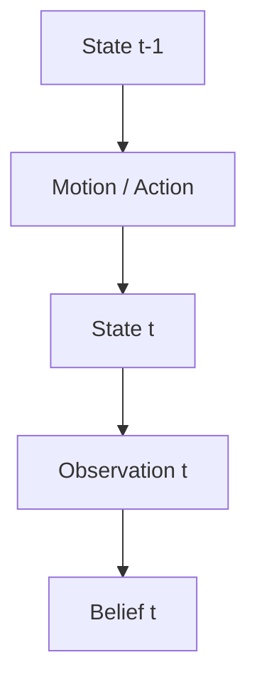
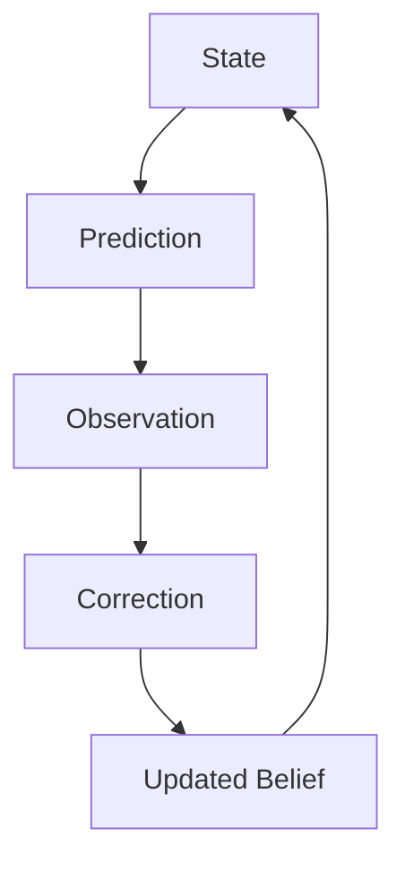

# Week 1 Chapter 5.5：为什么机器人能够利用时间？

## 本章目标

本章是 Week 1 中临时新增的一章，回答：

> 为什么机器人有资格利用上一帧的信息？

这不是理所当然的事实，而是基于一个重要假设：机器人生活在一个具有时间连续性和因果规律的世界中。

---

## 本章位置

Chapter 5 讨论 Belief 如何被 Observation 更新。本章把“时间”正式引入机器人学：



这会为 Bayes Filter、Kalman Filter、Particle Filter 和 SLAM 前端建立共同语言。

---

## 核心问题

### 不是所有世界都能预测

股票和彩票不一定具有可预测的局部连续性。今天是 `210$`，明天可能大幅变化；今天彩票是 `123456`，明天不会自然接近 `123457`。

机器人为什么可以预测？因为机器人通常生活在物理世界中：

> 世界本身具有连续性和因果关系。

所以：

> Prediction 不是算法带来的，而是世界本身允许 Prediction。

---

## 正文

### 1. 世界为什么可以预测

如果机器人当前 Pose 是：

```text
x = 1
y = 2
theta = 0°
```

`100ms` 后它最可能仍在附近，而不是突然跳到 `x = 1000`。

原因不是 Encoder 或 Camera，而是物理世界连续。机器人不能瞬移，速度、加速度和运动约束会限制未来状态。

### 2. 什么是 State

State 不是固定的一组变量，而是：

> State = 能够决定系统未来演化的最小信息集合。

不同系统和任务需要不同 State：

| 系统 / 任务 | 可能的 State |
| --- | --- |
| 摆钟 | 角度、角速度 |
| 汽车 | 位置、速度、方向、方向角速度 |
| 无人机 | 位置、姿态、速度、Bias |
| 扫地机器人 | `x`, `y`, `theta`, `vx`, `vy`, `omega` |
| Ground Detection | Ground Plane、法向量、高度、连续性、上一帧 Ground Mask |
| Target Tracking | `x`, `y`, `vx`, `vy` |

State 不是世界的完整描述，而是预测未来所需的接口。

### 3. Observation 为什么不是 State

Observation 不能唯一决定 State。

例如在重复长廊中，Camera 看到“墙、墙、墙”，但机器人可能在第 `1m`，也可能在第 `10m`。

方向要反过来理解：

```text
State -> 可以预测 Observation
Observation -> 不一定能唯一反推出 State
```

这也解释了为什么机器人常常容易建模 `P(z|x)`，但真正需要推断 `P(x|z)`。

### 4. Markov Assumption 是什么

Markov Assumption 的直觉不是背公式，而是：

> 如果我已经知道了现在，那么过去就不需要再直接参与未来预测。

更准确地说，State 需要被设计到足够包含预测未来所需的信息。如果 State 设计不足，例如只保存 Position 而没有 Velocity，未来预测就会失败。

### 5. 时间连续性如何统一不同机器人任务

很多看似不同的任务都在利用时间连续性：

| 任务 | 利用时间的方式 | 维护的 State |
| --- | --- | --- |
| Ground Detection | 地面形态不会帧间剧烈跳变 | 平面、法向量、高度、Mask 连续性 |
| 目标跟踪 | 目标位置和速度连续 | 位置、速度 |
| Kalman Filter | State 按 Motion Model 演化 | 位置、速度、协方差等 |
| SLAM Localization | Pose 连续变化 | Pose、Velocity、Bias 等 |

---

## 关键直觉

### 1. 机器人最大的先验是 Time

机器人不同于单张图像分类。它持续生活在：

```text
t-1 -> t -> t+1 -> t+2
```

所以时间本身就是巨大先验。

> 机器人最大的优势，不是拥有很多传感器，而是生活在一个连续的世界。

### 2. State 是 Prediction 的接口

很多变量和未来“相关”，但不是预测所必需。例如机器人颜色、Logo、电池品牌通常不是预测 Pose 的 State。

State 真正要求是：缺了它，就预测不了未来。

### 3. State Design 比套公式更重要

Kalman Filter 不是从公式开始，而是从 State Design 开始。如果 State 只包含 Position，没有 Velocity，Prediction 就会很差。

> State Design 错了，后面的滤波和优化都会跟着错。

---

## 学习中的问题

### Q1：为什么 Ground Detection、Tracking、Kalman、SLAM 看起来不同，却都在利用时间连续性？

因为它们维护的 State 不同，但共同逻辑相同：



它们都是用当前 State 预测未来，再用新 Observation 修正预测。

### Q2：State 是“和未来相关”的因素集合吗？

更准确地说：

> State = 能够决定系统未来演化的最小信息集合。

“相关”太宽，很多因素都可能相关；State 要求的是“预测未来不可缺少”。

### Q3：Markov Chain 和 Markov Assumption 有什么区别？

Markov Chain 强调状态之间的转移链；机器人中更常用的是 Markov Assumption 和 State Space Model。机器人状态不可直接完全观测，Observation 只是 State 的证据，所以后续会进一步进入 Hidden Markov Model 和 Bayes Filter。

---

## 本章小结

1. 机器人能预测未来，是因为物理世界具有连续性和因果规律。
2. Prediction 的根源不是算法，而是世界允许预测。
3. State 是决定系统未来演化的最小信息集合。
4. Observation 不是 State，它只是关于 State 的证据。
5. Markov Assumption 要求当前 State 已包含预测未来所需的信息。
6. 时间连续性统一了 Ground Detection、Tracking、Kalman 和 SLAM。

---

## 课后任务

1. 为 Ground Detection 设计一个 State，并说明每个变量为什么影响未来预测。
2. 解释为什么同一张图像 Observation 不能唯一决定机器人 State。
3. 思考：如果一个任务不满足时间连续性，Prediction 还是否有意义？

---

## 下一章

[[Week 1 Chapter 6|Week 1 Chapter 6：为什么机器人学本质上是一门建模的学科？]]

下一章从 State 进一步走向 Model：机器人到底如何把世界规律写成可预测、可修正的模型？

## 相关笔记

- [[Week 1 Chapter 5|Week 1 Chapter 5：贝叶斯思想到底是什么？]]
- 可后续沉淀概念：State、Prediction、Temporal Consistency、Markov Assumption、State Space Model
