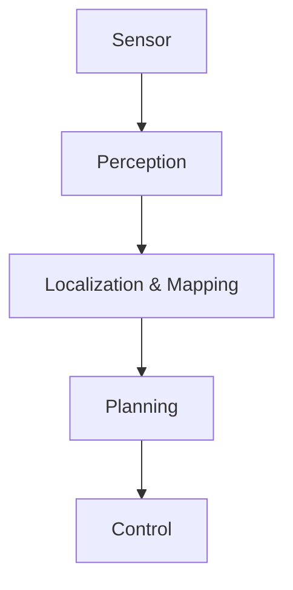
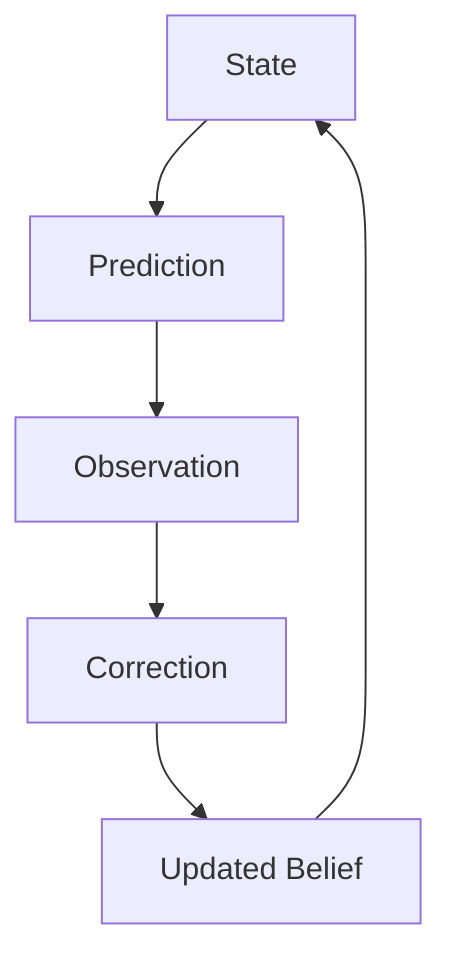
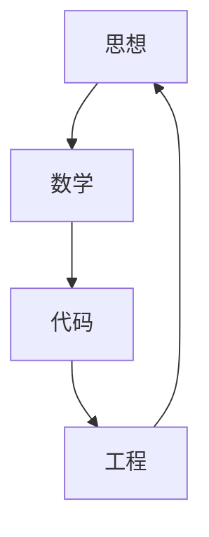

# Week 1 Summary：课程总结与 Week 2 调整

## 本周定位

Week 1 原本只是 `Robot Foundations` 的入门周，但实际学习路径明显向前推进：从机器人系统结构，一路进入 Observation、Belief、Bayesian Thinking、State、Model 和 Kalman Filter 的直觉推导。

这周真正完成的不是“知道 SLAM 是什么”，而是建立了：

> 机器人是一个动态概率推理系统。

---

## 学习轨迹

### Chapter 1：模块思维

最开始的问题是：

> 为什么机器人需要 SLAM？

初始理解还停留在模块层面：

```text
Encoder -> SLAM -> Map
```

Chapter 1 建立了机器人软件信息流：



### Chapter 3：信息流思维

到 Chapter 3，关键词开始变成：

- Observation
- Truth
- Belief
- Confidence
- Fusion

思维从 `Camera / LiDAR / Encoder` 转向 `Information`。

### Chapter 5：概率思维

Chapter 5 开始讨论：

- Belief
- Prediction
- Prior
- Posterior

这意味着课程已经进入 Probabilistic Robotics 的核心入口：机器人不是重新认识世界，而是不断更新自己的 Belief。

### Chapter 5.5：State 思维

本周最关键的转折是对 State 的重新定义：

> State = 能够决定系统未来演化的最小信息集合。

这个定义把 Ground Detection、Tracking、SLAM、Pose Estimation 等任务统一到同一个框架：



### Chapter 6-8：框架思维

后半周进一步进入：

- Model
- Prediction
- Observation
- Information Gain
- Kalman Gain

此时学习目标已经从“学会某个 SLAM 算法”升级为：

> 把任何机器人问题抽象成 State Estimation Problem。

---

## 本周收获

### 1. 从模块思维到信息流思维

早期容易把机器人系统看成模块拼接：

```text
Camera
LiDAR
Encoder
SLAM
Map
```

现在更应该看成：

```text
Observation
Belief
Prediction
Correction
Information Gain
```

### 2. 从算法思维到建模思维

本周最重要的变化不是知道 Kalman Filter，而是理解：

> Algorithm solves a Model, but Intelligence comes from the Model itself.

算法只是求解器，真正决定系统上限的是 State Design、Motion Model、Observation Model 和 Uncertainty Model。

### 3. 从单点答案到概率分布

Localization 输出的不是一个绝对 Pose，而是 Belief over Pose。Pose 只是 Belief 的一个读数。

### 4. 从传感器融合到信息融合

真正融合的不是 Camera、LiDAR、IMU 这些硬件，而是它们提供的信息，以及这些信息在当前场景下能减少多少不确定性。

---

## 目前短板

### 1. 抽象需要落回数学、代码和工程

当前抽象能力很强，但后续需要持续做四层来回切换：



否则容易停留在哲学层面。

### 2. 统一框架时要注意边界

Kalman、Particle Filter、Graph Optimization 都属于 State Estimation，但它们解决的问题并不相同。

后续要持续区分：

- 哪些东西真的统一？
- 哪些只是看起来统一？
- 哪些差异会影响工程选择？

### 3. 建模能力是优势，也是下一阶段重点

目前最突出的能力不是 SLAM 或 Vision 本身，而是建模思维：

- State 为什么这样定义？
- Prediction 为什么存在？
- Observation 为什么不能等于 State？
- Model 为什么比算法更根本？

下一阶段要把这种建模思维落到概率、公式和工程参数上。

---

## 第二阶段课程调整

原计划可能是：

```text
Bayes -> Kalman -> Particle -> SLAM
```

根据 Week 1 的实际推进，课程调整为：

> Probabilistic State Estimation（概率状态估计）

建议顺序：

| Chapter | 主题 | 为什么放在这里 |
| --- | --- | --- |
| Chapter 9 | Information | 区分 Data、Noise、Information Gain |
| Chapter 10 | Probability | 给 Belief 提供数学语言 |
| Chapter 11 | Uncertainty | 建模 Prediction 和 Observation 的可靠性 |
| Chapter 12 | Gaussian | 理解为什么高斯在机器人中如此常见 |
| Chapter 13 | Bayes Filter | 把 Belief Update 写成递推框架 |
| Chapter 14 | Kalman Filter | 在高斯和线性假设下得到具体滤波器 |

---

## 下一周入口

Week 2 建议从 Chapter 9 开始：

> What is Information?（到底什么才叫信息？）

这会成为理解主动感知、信息增益、回环检测、探索规划和 Embodied AI 的共同起点。

## 相关笔记

- [[Week 1 Chapter 1|Week 1 Chapter 1：机器人到底是什么？]]
- [[Week 1 Chapter 5.5|Week 1 Chapter 5.5：为什么机器人能够利用时间？]]
- [[Week 1 Chapter 8|Week 1 Chapter 8：如果世界上没有 Kalman Filter，我们能不能自己推导出来？]]
