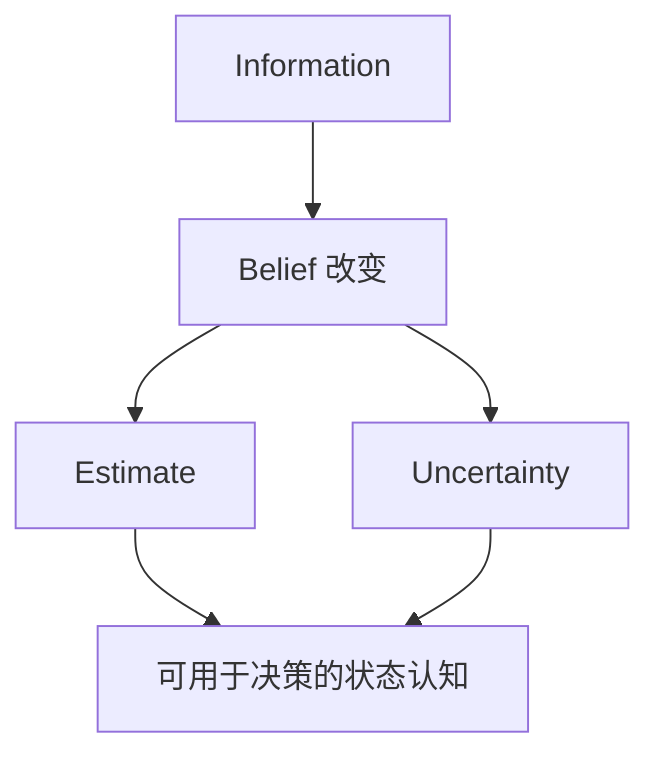
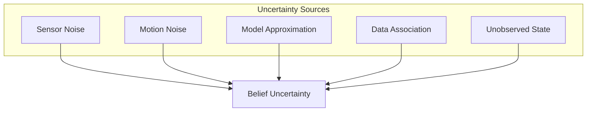
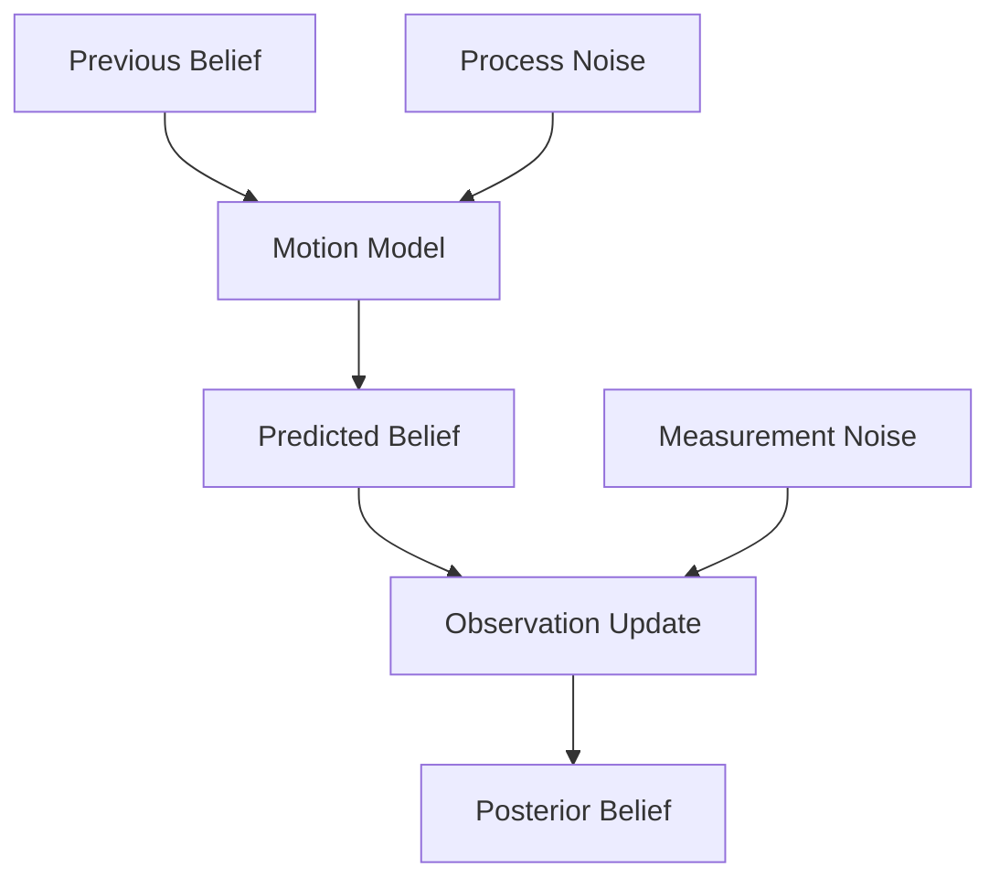

# Week 2 Chapter 10：为什么机器人必须维护不确定性？

## 本章目标

- 区分 Error、Uncertainty 与 Confidence
- 理解单点 Estimate 为什么不完整
- 认识不确定性的来源、传播与用途

## 本章位置

## 核心问题

### 为什么不能只输出最佳估计？

$10\pm0.01$ 与 $10\pm100$ 的中心值相同，但对规划、融合和风险判断意味着完全不同的事情。没有 Uncertainty，系统无法知道自己是否值得被相信。

## 正文

### 1. Error 与 Uncertainty

Error 依赖未知 Truth：

$$
e = \hat{x} - x
$$

其中 $x$ 是真实状态，$\hat{x}$ 是估计。在线运行时，机器人通常不知道 $x$，因此也不知道当前真实 Error。

Uncertainty 描述机器人对潜在 Error 或 State 范围的认知。它不是已经发生的误差，而是“可能错多少、向哪些方向错”的模型。

### 2. Confidence 不是一个孤立分数

Confidence 常被口语化地理解为“相信程度”，但工程上必须说明它由什么量表达：概率、方差、协方差、分类分数，还是经验阈值。不同定义不能直接比较。

### 3. 不确定性的来源

- **Aleatoric uncertainty**：测量或过程本身的随机变化。
- **Epistemic uncertainty**：模型、参数或知识不足造成的未知。

这两个术语有助于理解来源，但具体系统未必能将二者完全分离。

### 4. 不确定性会传播

当 Prediction 依赖一个不确定 State 时，输出也会不确定。非线性模型还可能改变不确定性的形状和方向。

粗略地说：

### 5. 为什么系统需要不确定性

- **融合**：决定 Prediction 与 Observation 应各占多少权重。
- **Gating**：判断 Observation 与当前 Belief 是否相容。
- **规划**：避免在高度不确定时执行高风险动作。
- **诊断**：判断系统是在正常噪声下波动，还是模型已经失效。
- **主动感知**：选择能有效降低关键方向不确定性的动作。

### 6. 不确定性小不等于估计正确

系统可能因为错误模型、错误数据关联或不一致的噪声参数而过度自信。此时 Covariance 很小，真实 Error 却很大。

因此需要区分：

| 情况 | 真实 Error | 报告的不确定性 | 含义 |
| --- | --- | --- | --- |
| 理想 | 小 | 小 | 准确且自洽 |
| 保守 | 小 | 大 | 正确但不够自信 |
| 可识别失败 | 大 | 大 | 系统知道自己不可靠 |
| 危险 | 大 | 小 | 错误且过度自信 |

## 关键直觉

> [!tip] 导师提示
> 真正成熟的估计器不仅给答案，还要给出“这个答案有多脆弱”。

Uncertainty 不是附属统计量，而是 Belief 的组成部分。没有它，Prediction、Correction、Gating 和风险决策都缺少统一尺度。

## 易混点

- **Noise** 是产生随机变化的模型；**Uncertainty** 是系统对未知状态的表达。
- **Residual 小** 只表示预测观测和实际观测接近，不自动证明状态准确。
- **Covariance 小** 只在模型一致时才意味着较高可信度。

## 本章小结

$$
\boxed{\text{State Estimate} = \text{Estimate} + \text{Uncertainty}}
$$

## 思考题

### 思考题 1

为什么机器人无法直接计算在线 Error？

> [!answer]- 参考答案
> Error 需要真实状态 $x$，而状态估计问题的前提正是 $x$ 不可直接获得。机器人只能利用模型、观测和历史数据维护对 Error 的概率性认知。

### 思考题 2

Covariance 很小但结果错误，可能由什么造成？

> [!answer]- 参考答案
> 可能存在错误数据关联、模型偏差、噪声参数低估、未建模相关性或线性化失效。此时系统内部的 Uncertainty 与真实 Error 不一致。

## 下一章

[[Week 2 Chapter 11|Week 2 Chapter 11：系统如何判断 Observation 是否可信？]]

