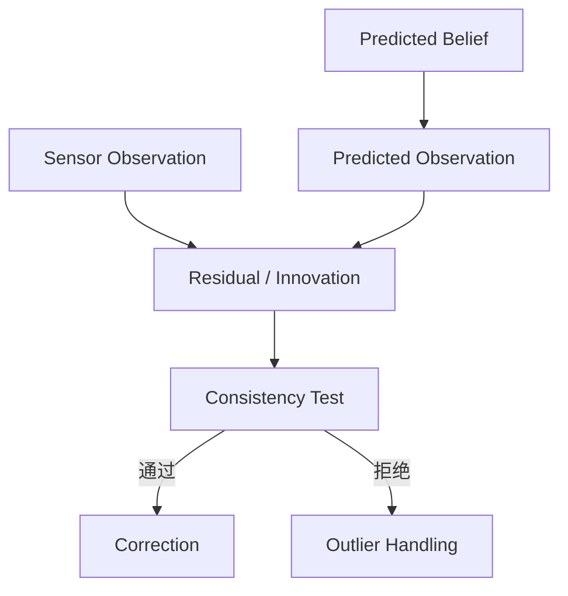
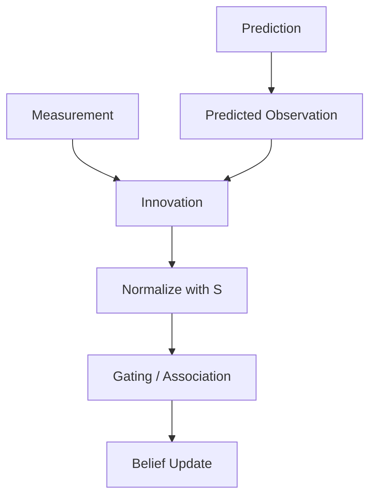

# Week 2 Chapter 11：系统如何判断 Observation 是否可信？

## 本章目标

- 理解 Observation Validation 与 Data Association
- 区分测量值、预测观测、Residual 和 Innovation
- 建立 Gating 的概率直觉

## 本章位置

## 核心问题

### Observation 来了，就应该用于更新吗？

不应该。测量可能来自噪声、误匹配、动态物体或错误目标。系统必须先判断它是否与当前预测和不确定性相容。

## 正文

### 1. 从状态空间预测观测

Observation Model 将状态映射到传感器空间：

$$
\hat{\mathbf{z}}_t = h(\hat{\mathbf{x}}_{t|t-1})
$$

其中 $\hat{\mathbf{x}}_{t|t-1}$ 是更新前状态估计，$h(\cdot)$ 是观测模型，$\hat{\mathbf{z}}_t$ 是预测观测。

只有把预测和测量放到同一 Observation Space，二者才可比较。

### 2. Residual 与 Innovation

常见定义为：

$$
\mathbf{r}_t = \mathbf{z}_t - \hat{\mathbf{z}}_t
$$

在 Kalman Filter 语境中，更新前的观测差通常称为 Innovation：

$$
\boldsymbol{\nu}_t
=
\mathbf{z}_t - \mathbf{H}_t\hat{\mathbf{x}}_{t|t-1}
$$

Residual 的用法在不同领域并不完全统一，整理笔记时必须声明所采用的定义。本课程后续优先用 Innovation 表示更新前的新息。

### 3. 只看差值大小不够

$1\text{ m}$ 的 Innovation 在高精度室内定位中可能异常，在粗糙 GPS 定位中可能完全正常。判断必须结合 Innovation Covariance：

$$
\mathbf{S}_t
=
\mathbf{H}_t\mathbf{P}_{t|t-1}\mathbf{H}_t^\top
+
\mathbf{R}_t
$$

其中 $\mathbf{P}_{t|t-1}$ 是预测协方差，$\mathbf{R}_t$ 是观测噪声协方差。

### 4. Mahalanobis Gating

归一化距离为：

$$
d^2
=
\boldsymbol{\nu}_t^\top
\mathbf{S}_t^{-1}
\boldsymbol{\nu}_t
$$

它衡量 Innovation 相对于预期不确定性有多异常。若线性 Gaussian 假设成立，$d^2$ 可与卡方分布阈值比较。

> [!note] 成立条件
> 卡方门限依赖 Innovation 近似零均值 Gaussian、$\mathbf{S}_t$ 建模合理以及自由度选择正确。它不是适用于所有异常值的万能阈值。

### 5. Data Association

Gating 回答“某个匹配是否可能”，Data Association 还要回答“这个 Observation 属于哪个 Landmark 或 Track”。常见失败包括：

- 把相似地标匹配错
- 把动态物体当成静态地图
- 多个观测竞争同一目标
- 真正匹配被过严门限拒绝

错误关联往往比普通测量噪声更危险，因为它会让估计器对错误约束变得自信。

### 6. Gating 之后仍需稳健处理

通过 Gating 不代表 Observation 一定正确。工程系统还可能使用 Robust Kernel、RANSAC、多假设跟踪或延迟确认。Gating 是一致性筛选的一层，不是 Truth Detector。

## 关键直觉

> [!tip] 导师提示
> 不要问“Residual 大不大”，要问“它相对于系统预期的不确定性大不大”。

Observation 的可信度来自模型一致性，而不只是传感器自身分数。

## 易混点

- Innovation 小不代表 State 一定准确，系统可能在弱可观测方向上共同漂移。
- Gating 拒绝 Observation 不代表传感器损坏，也可能是 Prediction 失效。
- Feature Extraction 产生候选 Observation；Observation Model 说明 State 如何生成它们。

## 本章小结

## 思考题

### 思考题 1

为什么固定欧氏距离阈值不适合所有观测？

> [!answer]- 参考答案
> 因为不同预测和传感器的不确定性不同。固定阈值忽略了方向相关尺度，而 Mahalanobis Distance 使用 $\mathbf{S}$ 对差异进行归一化。

### 思考题 2

一个 Observation 通过 Gating 后为什么仍可能是错的？

> [!answer]- 参考答案
> Gating 只判断它与当前统计模型是否相容。重复纹理、相似地标或模型失配可能让错误匹配仍落在门内。

## 下一章

[[Week 2 Chapter 11.5|Week 2 Chapter 11.5：从 Data 到 Constraint]]

