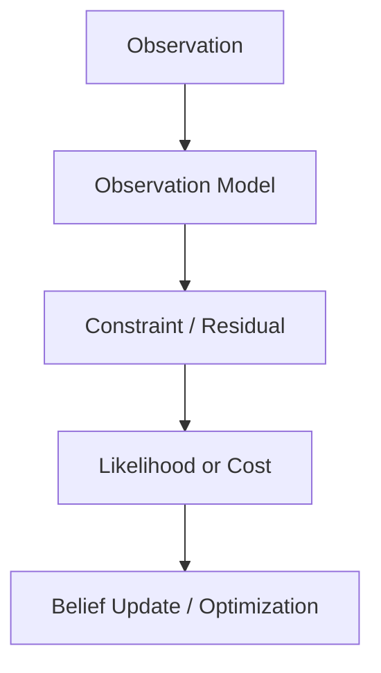
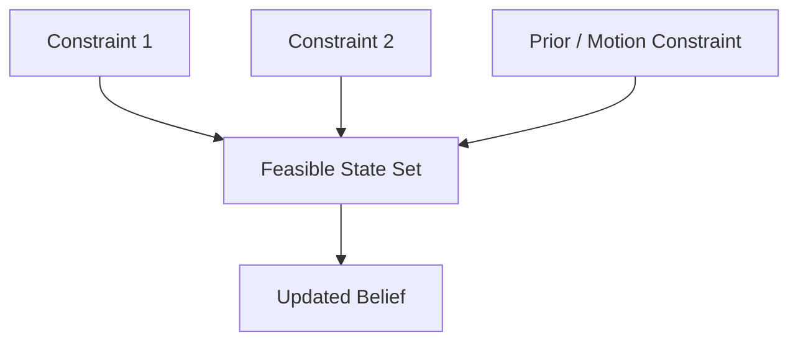
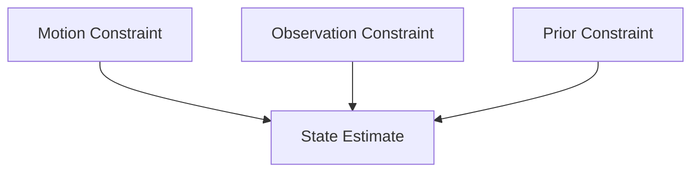

# Week 2 Chapter 12：Constraint 为什么是机器人估计的语言？

## 本章目标

- 理解 Constraint 如何连接 Observation 与 State
- 区分硬约束、软约束和概率约束
- 建立 Filtering 与 Optimization 的统一视角

## 本章位置

## 核心问题

### 为什么 Observation 不能直接修改 State？

Observation 通常位于传感器空间，而 State 位于状态空间。Constraint 通过模型表达“哪些 State 能解释当前 Observation，以及解释得有多好”。

## 正文

### 1. 从观测模型到约束

一般观测模型为：

$$
\mathbf{z} = h(\mathbf{x}) + \mathbf{v}
$$

对应 Residual：

$$
\mathbf{r}(\mathbf{x})
=
\mathbf{z} - h(\mathbf{x})
$$

求解的目标不是强行让所有 Residual 为零，而是在噪声模型下找到最能解释观测的 State。

### 2. 硬约束与软约束

- **硬约束**：必须严格满足，例如某些机械连接或归一化条件。
- **软约束**：允许偏差，并用权重或概率描述可信度。

机器人传感器测量通常应作为软约束，因为 Noise、Outlier 和模型误差不可避免。

### 3. 从 Noise 到加权误差

若：

$$
\mathbf{v}\sim\mathcal{N}(\mathbf{0},\mathbf{R})
$$

则观测的负对数似然忽略常数后为：

$$
\frac{1}{2}
\mathbf{r}(\mathbf{x})^\top
\mathbf{R}^{-1}
\mathbf{r}(\mathbf{x})
$$

$\mathbf{R}^{-1}$ 表示 Information Matrix：噪声越小，约束权重通常越大。

> [!note] 假设
> 上式依赖零均值 Gaussian Noise。非 Gaussian 或含 Outlier 的情形通常需要其他似然模型或 Robust Loss。

### 4. Constraint 的几何意义

一个 Observation 未必能确定完整 State。距离测量可能把二维位置限制在圆上，方位测量可能限制在射线上；多个独立约束相交后才逐渐缩小可行区域。

### 5. Filtering 与 Optimization

Filtering 按时间递归吸收 Constraint；Optimization 通常联合考虑一组 Constraint。两者表示和计算方式不同，但都在寻找能同时解释模型与 Observation 的 State。

### 6. Constraint 也可能错误

错误数据关联、动态物体和错误模型都会产生错误约束。强而错误的 Constraint 比弱噪声更危险，因此需要 Gating、Robust Estimation 和一致性检查。

## 关键直觉

> [!tip] 导师提示
> Observation 是传感器说了什么；Constraint 是这句话对 State 排除了什么。

- Constraint 的信息强度取决于噪声和几何结构。
- 多个约束的价值不仅在数量，还在方向是否互补。
- 估计问题可以理解为寻找最能同时满足一组软约束的 State。

## 易混点

- Residual 为零不保证模型正确，系统可能过拟合或存在退化。
- 权重大不等于 Observation 一定正确，只代表模型声称它更可靠。
- Constraint 数量多不等于系统可观测，重复约束可能沿同一方向提供信息。

## 本章小结

$$
\boxed{
\text{Observation}
+
\text{Model}
\rightarrow
\text{Constraint on State}
}
$$

## 思考题

### 思考题 1

为什么机器人传感器测量通常不应作为硬约束？

> [!answer]- 参考答案
> 因为测量含噪声、模型近似和潜在异常值。硬约束会迫使状态完全满足错误测量，而软约束允许根据不确定性进行权衡。

### 思考题 2

两个数量很多但方向相同的约束，为什么可能仍不够？

> [!answer]- 参考答案
> 它们主要重复强化同一 State Direction，对正交方向没有提供可区分信息，因此系统仍可能退化或不可观测。

## 下一章

[[Week 2 Chapter 13|Week 2 Chapter 13：从最佳估计到概率分布]]
