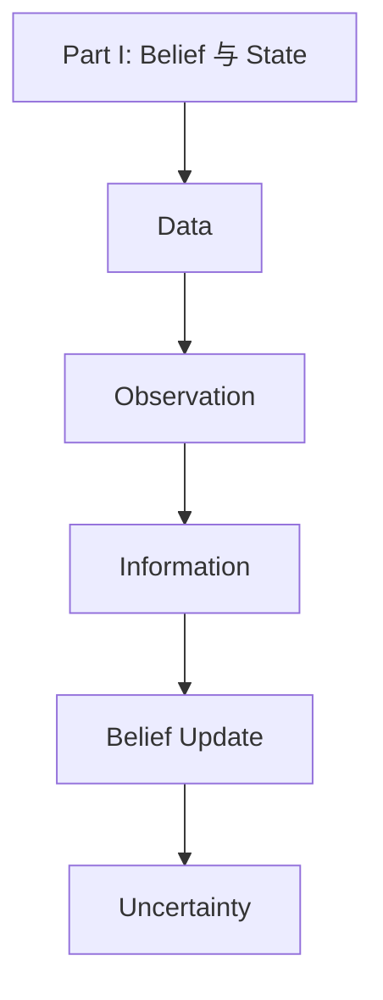
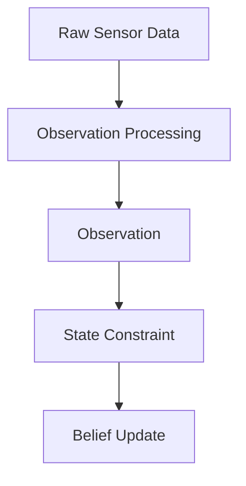
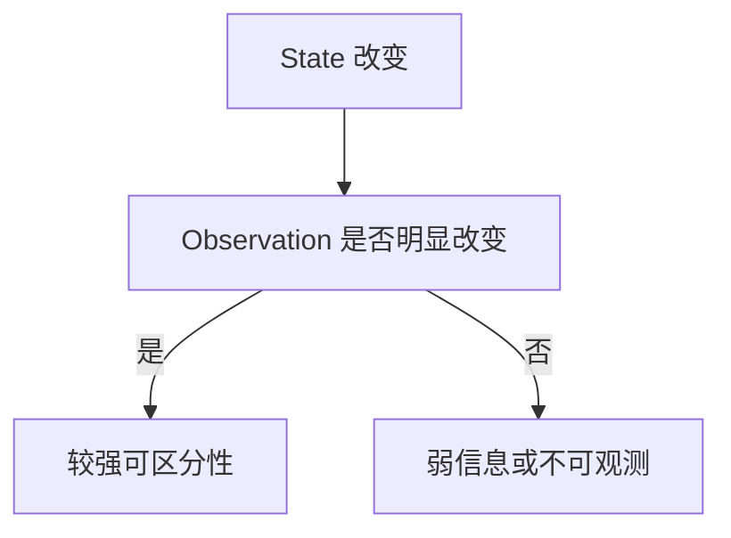

# Week 2 Chapter 9：什么才是真正的信息？

## 本章目标

- 区分 Data、Observation 与 Information
- 从“不确定性是否下降”理解信息
- 建立 Information Gain 与主动感知的直觉

## 本章位置

Part I 解释机器人为什么必须维护 Belief；Part II 从本章开始讨论如何量化和更新它。

## 核心问题

### 数据越多，信息就越多吗？

不一定。信息不是数据量，而是数据对当前未知状态的区分能力。重复拍摄几乎相同的画面会产生大量 Data，却可能没有明显减少定位的不确定性。

## 正文

### 1. Data、Observation 与 Information

| 层级 | 含义 | 示例 |
| --- | --- | --- |
| Data | 传感器记录的原始数值 | Image、Point Cloud、IMU samples |
| Observation | 经过处理、与状态相关的测量 | Feature、Range、Bearing |
| Information | Observation 对 Belief 的有效约束 | 排除位置假设、降低协方差 |

可以把处理链写成：

Observation 不是 Truth。它仍然受噪声、遮挡、误匹配和模型偏差影响。

### 2. 信息取决于当前 Belief

同一个 Observation 对不同 Belief 的价值不同：

- 已经确信自己位于房间中央时，再看到中央地标，新增信息有限。
- 在两个位置假设之间摇摆时，一个能区分二者的地标很有价值。
- 在重复长廊中，看到相同门框通常不能解除位置歧义。

因此 Information 不是 Observation 自带的固定属性，而是 Observation 与当前 Belief 共同决定的。

### 3. 信息意味着减少不确定性

直觉上可以写成：

$$
\text{Information Gain}
=
\text{Uncertainty Before}
-
\text{Uncertainty After}
$$

这不是本章对信息论量的严格定义，而是后续理解熵、协方差和 Fisher Information 的入口。

### 4. 信息需要可区分性

如果不同 State 会产生几乎相同的 Observation，传感器就难以区分它们。反之，Observation 随 State 改变明显时，通常能提供更强约束。

这条直觉将在后续变成：

### 5. 从被动感知到主动感知

机器人不只可以接收信息，还可以选择动作来获取信息。例如改变视角、绕开遮挡、选择更有辨识度的观测位置。

这连接到 Active Perception、Next Best View、Exploration 和 Active SLAM：动作不仅改变物理状态，也能改变未来 Observation 的信息量。

## 关键直觉

> [!tip] 导师提示
> 传感器产生的是 Data，模型提取的是 Observation，只有能够改变 Belief 的部分才成为 Information。

- Data 多不代表 Information 多。
- Observation 新不代表它能区分当前的状态假设。
- 信息的价值必须相对于 State、Belief 和任务来讨论。
- 好的动作有时不是立刻接近目标，而是先让系统“看得更清楚”。

## 易混点

### Information 和 Accuracy 是一回事吗？

不是。一个 Observation 可以明显缩小假设空间，但仍不足以给出准确的单点估计。信息描述认知变化，Accuracy 描述估计与 Truth 的接近程度。

### Observation Processing 会创造信息吗？

它不会凭空创造传感器没有携带的信息，但能提取、组织并强调与任务相关的部分，也可能因为压缩或错误模型丢失信息。

## 本章小结

$$
\boxed{
\text{Information is the part of an observation that changes belief.}
}
$$

本章把课程从“机器人收到什么”推进到“这些观测让机器人少不知道了什么”。下一章将进一步讨论为什么这种未知必须被显式维护。

## 思考题

### 思考题 1

为什么重复长廊中的大量图像可能仍然不能解决定位？

> [!answer]- 参考答案
> 因为不同位置可能产生近似相同的视觉 Observation，数据量虽然增加，但对位置假设的可区分性很弱，Belief 仍可能保持多峰。

### 思考题 2

机器人为什么有时应该主动换一个视角？

> [!answer]- 参考答案
> 新视角可能打破遮挡或对称性，使不同 State 产生更不同的 Observation，从而获得更高 Information Gain。

## 下一章

[[Week 2 Chapter 10|Week 2 Chapter 10：为什么机器人必须维护不确定性？]]

## 相关笔记

- [[../Part I Robot Foundations/Week 1 Chapter 3|Week 1 Chapter 3：Observation、Reality 与 Belief]]
- [[../Part I Robot Foundations/Week 1 Chapter 4|Week 1 Chapter 4：Belief over Pose]]

