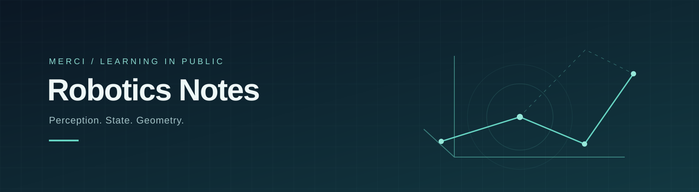

# 机器人学习笔记

从传感器读数到可解释的估计，再到机器人对空间与运动的理解。

这里记录我学习机器人感知与 SLAM 的过程：先说明问题为什么出现，再建立概念、模型和计算方法。正文保留有助于理解的推理、问答和练习，便于连续学习，也便于回头查阅。

## 从这里开始

<table data-view="cards"><thead><tr><th></th><th></th><th data-hidden data-card-target data-type="content-ref"></th></tr></thead><tbody><tr><td><strong>阅读指南</strong></td><td>了解前置知识、阅读顺序和笔记的使用方式。</td><td><a href="getting-started.md">getting-started.md</a></td></tr><tr><td><strong>SLAM · 机器人基础</strong></td><td>从系统信息流走到状态、Belief 与预测校正循环。</td><td><a href="slam/foundations/">foundations</a></td></tr><tr><td><strong>术语与公式</strong></td><td>对照中英文概念，复算一个完整的贝叶斯更新例子。</td><td><a href="reference/">reference</a></td></tr></tbody></table>

## 当前可以读什么

**Part I 已整理为连续阅读路径**：9 篇章节笔记与 1 篇阶段总结，包含补充章节 Chapter 5.5。

Part II 的概率状态估计、Part III 的空间状态估计已有学习材料，正在继续整理。具体进度和源文档入口见[学习路线](roadmap.md)。

## 读完第一部分，你应当能回答

* 感知、定位、建图、规划和控制分别解决什么问题？
* 为什么观测不等于真实状态，为什么估计需要表达不确定性？
* 状态、Belief、模型与预测校正之间怎样衔接？
* 贝叶斯更新和 Kalman Gain 分别在解决什么问题？

## 关于这份笔记

这是持续修订的个人学习笔记。直觉解释会明确与公式推导区分；发现错误后会记录修订。使用公式时，请一并阅读其假设和适用条件。

[关于作者与笔记](about.md) · [更新记录](changelog.md) · [GitHub 源码](https://github.com/hyandnn/my-learning-notes) · [个人网站](https://hyandnn.github.io/)
