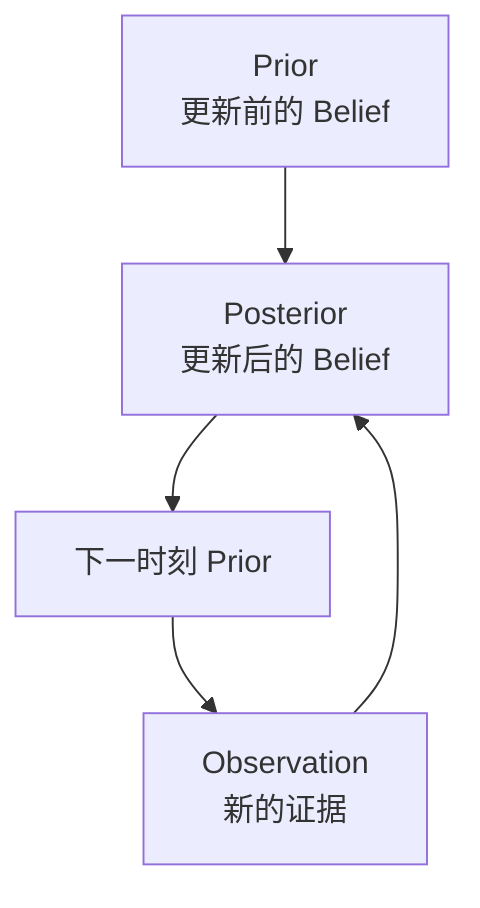

# 贝叶斯更新的直觉

> 阅读定位：本部分以直觉和问题拆解为主。涉及具体滤波公式时，应同时确认模型、噪声和独立性假设；严格推导将随 Part II 整理补充。

## 本章目标

本章不从贝叶斯公式开始，而是先回答：

> 为什么贝叶斯思想几乎是唯一合理的信息更新方式？

真正要理解的不是公式，而是机器人如何把已有 Belief 和新的 Observation 结合，得到更新后的 Belief。

---

## 本章位置

前面几章建立了：

- 机器人只能得到 Observation
- 机器人维护的是 Belief
- Localization 维护的是 Belief over Pose

本章讨论 Belief 如何被更新：



---

## 核心问题

### Belief 为什么不能推倒重来？

人听到“喵”的声音时，不会每次从零开始认识世界，而是把声音、猫粮、猫毛等证据逐步叠加，持续更新“家里有猫”的 Belief。

机器人也是一样。它不会每一帧重新认识世界，而是把上一时刻的 Belief 作为基础，再用新的 Observation 修正。

这就是：

> Incremental Understanding（渐进理解）。

---

## 正文

### 1. Prior 是什么

Prior 不是 Truth，而是：

> 更新之前，机器人已经相信的东西。

例如上一时刻 Localization 认为：

```text
我在 (5, 3)
```

这就是当前更新的 Prior。

### 2. Observation 是什么

Observation 不是 Reality，而是新的证据。

Camera 看到“门”，并不等于机器人一定在门口；它只是提供了一个证据，让机器人修改自己的 Belief。

### 3. Posterior 是什么

Posterior 是更新后的 Belief。

例如机器人原来认为：

```text
客厅：80%
厨房：20%
```

后来看到冰箱，于是更新为：

```text
客厅：10%
厨房：90%
```

这个更新后的 Belief 就是 Posterior。到下一时刻，它又会变成新的 Prior。

### 4. 贝叶斯真正解决的问题

贝叶斯不是“求概率”的工具那么简单。它真正解决的是：

> 如何合理地修改 Belief。

一个合理的更新规则至少应满足：

1. 不能忘掉过去：Prior 要参与。
2. 不能无视新证据：Observation 要参与。
3. 新证据越可靠，更新幅度越大。
4. 更新后的 Belief 仍然要是合理的概率分布。

### 5. 条件概率方向不能混淆

看到冰箱后，机器人真正想知道的是：

```text
P(厨房 | 看到冰箱)
```

但机器人更容易建模的是：

```text
P(看到冰箱 | 厨房)
```

这两个不是一回事。

例如：

| 概率 | 含义 |
| --- | --- |
| `P(看到冰箱 | 厨房)` | 如果我在厨房，看到冰箱的概率 |
| `P(厨房 | 看到冰箱)` | 如果我看到了冰箱，我在厨房的概率 |

贝叶斯公式存在的核心原因，就是把“状态下产生观测的概率”转换成“看到观测后状态成立的概率”。

### 6. Prior 和 Likelihood 为什么要合成 Posterior

扫地机器人定位时可能有：

```text
Prior:
客厅 50%
厨房 50%
```

Camera 看到冰箱后，传感器模型可能给出：

```text
P(看到冰箱 | 厨房) ≈ 99%
P(看到冰箱 | 客厅) ≈ 5%
```

机器人真正要求的是：

```text
P(厨房 | 看到冰箱)
```

所以它必须把 Prior 和 Likelihood 合成新的 Belief。

---

## 关键直觉

### 1. 贝叶斯不是公式，而是更新世界模型的方法

> 贝叶斯公式不是被记住的，而是被“逼出来”的。

当机器人已经有 Prior，又获得 Observation，且 Observation 在不同 State 下的出现概率不同，贝叶斯更新就自然出现。

### 2. 机器人一直在渐进理解世界

机器人不需要每帧推倒重来。上一秒的 Belief 很有价值，新一帧 Observation 只是让它调整世界模型。

### 3. Observation 独立性是一个假设

前面的讨论默认不同 Observation 彼此独立，但现实并非总是如此：

- Camera 连续 10 帧看到同一堵墙。
- IMU 连续 100ms 都有同方向漂移。
- Encoder 连续在湿滑地面打滑。

这会引出时间相关性、状态空间模型和后续滤波方法。

---

## 学习中的问题


<details>

<summary>Q1：看到冰箱后，应该直接把厨房设为 100% 吗？</summary>

不应该。看到冰箱是强证据，但不是绝对真相。冰箱也可能出现在开放式客厅、餐厅、商店等场景。

更合理的是根据 Prior、Likelihood 和观测可靠性更新成某个概率分布，而不是直接清零其他可能性。

</details>

<details>

<summary>Q2：为什么 `P(z|x)` 和 `P(x|z)` 差别这么大？</summary>

因为前者是“如果状态成立，观测出现的概率”；后者是“观测已经出现，状态成立的概率”。机器人经常能建立前者，却真正需要后者。

这正是贝叶斯公式的工作。

</details>

<details>

<summary>Q3：连续 Observation 不独立时会发生什么？</summary>

如果 Observation 之间有时间相关性，机器人不能把每一帧当成全新的独立证据。它必须建模 State 随时间演化，并把上一时刻的 State 和当前 Observation 联系起来。

这正是 Chapter 5.5 要讨论的问题。

---

</details>

## 本章小结

1. Prior 是更新之前的 Belief，不是 Truth。
2. Observation 是新的证据，不是答案。
3. Posterior 是更新后的 Belief，并会成为下一时刻 Prior。
4. 贝叶斯思想解决的是 Belief 如何合理更新。
5. 条件概率方向不能混淆：机器人常知道 `P(z|x)`，但真正需要 `P(x|z)`。
6. Observation 的时间相关性会引出 State Space Model 和动态状态估计。

---

## 课后任务

1. 用厨房和冰箱例子解释 Prior、Likelihood、Observation、Posterior。
2. 举一个 `P(A|B)` 和 `P(B|A)` 完全不同的例子。
3. 思考：如果连续 10 帧观测并不独立，机器人还能把它们当成 10 份证据吗？

---

## 下一章

[Week 1 Chapter 5.5：为什么机器人能够利用时间？](state-and-time.md)

下一章是原计划外新增章节：在写贝叶斯公式前，先理解时间连续性、State 和 Markov Assumption。

## 相关笔记

- [Week 1 Chapter 4：为什么机器人维护的是一个概率分布，而不是一个位置？](belief-over-pose.md)
- 可后续沉淀概念：Prior、Likelihood、Posterior、Bayesian Update、Bayes Filter


## 可复算的例子

用相同的“厨房与冰箱”例子代入公式，见[贝叶斯更新例题](../../reference/bayes-worked-example.md)。
