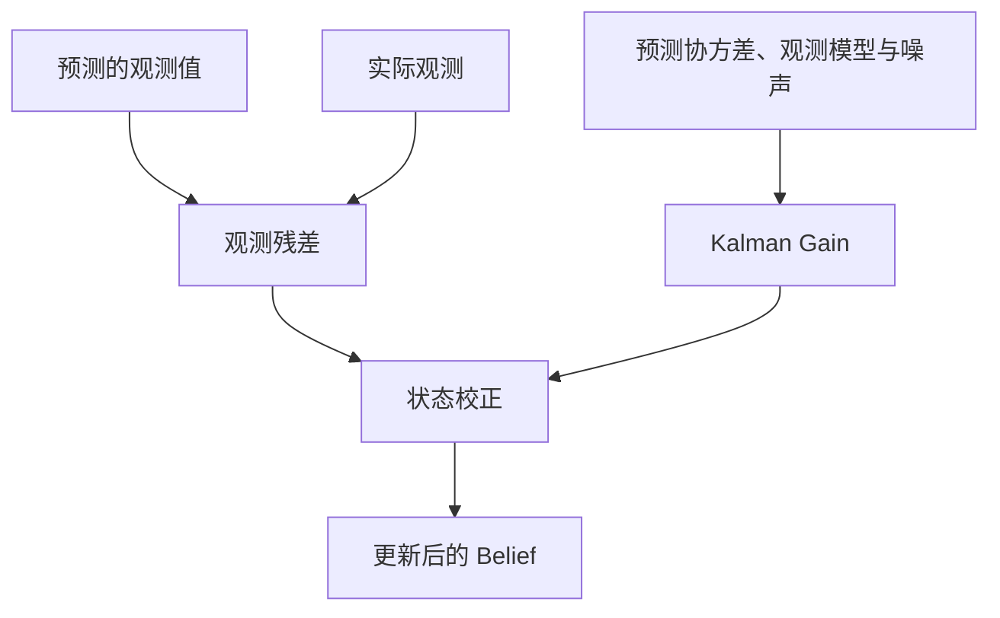

# Kalman Gain 的直觉

> 阅读定位：本部分以直觉和问题拆解为主。涉及具体滤波公式时，应同时确认模型、噪声和独立性假设；严格推导将随 Part II 整理补充。

## 本章目标

本章不写矩阵、不写高斯、不写协方差公式，只做一件事：

> 作为一个科学家，设计一种合理的信息融合规则。

重点是理解带不确定性的预测与观测为什么需要融合，再看 Kalman Filter 在特定模型下如何实现它。

---

## 本章位置

Chapter 7 已经提出：机器人需要判断何时更相信 Prediction，何时更相信 Observation。本章建立融合规则的直觉：



---

## 核心问题

### Prediction 和 Observation 不一致时怎么办？

假设：

```text
Prediction: 10m
Observation: 12m
```

不能总是直接取平均，因为两者可靠性可能不同。在这里先考虑同一坐标、同一物理量的直接观测，并假设误差独立、零均值且方差可信。此时可按不确定性分配权重；条件对称时，平均数正是合理结果。

---

## 正文

### 1. 平均数为什么不够

如果 Prediction 来自 Encoder，Observation 来自 Camera，为什么一定 `50% / 50%`？

可能是：

```text
Prediction 70%，Observation 30%
```

也可能是：

```text
Prediction 10%，Observation 90%
```

因此，平均数不是根本答案。

### 2. 什么时候该相信谁

几个极端例子，表中 ± 后的数值均表示标准差：

| Prediction | Observation | 合理直觉 |
| --- | --- | --- |
| `10m ±100m` | `12m ±1cm` | 几乎相信 Observation |
| `10m ±1cm` | `12m ±100m` | 几乎相信 Prediction |
| `10m ±1m` | `12m ±1m` | 融合到中间 |

这说明：

> 可信度越高，话语权越大。

### 3. Kalman Gain 的直觉定义

教材常把 Kalman Gain 写成公式，但直觉上它回答的是：

> 当前观测残差，应该怎样转化为对状态估计的修正？

在上述一维直接观测例子中，Gain 可以理解为观测的权重。一般情况下，它是把观测空间中的残差映射到状态空间的矩阵，由预测协方差、观测模型和观测噪声共同决定。

“新信息有多少”有助于形成融合直觉，但 Kalman Gain 本身不等于信息论中的信息增益，也不由本次观测值的大小直接决定。

### 4. Kalman 是动态权重调整器

Prediction 的不确定性不是固定的。预测越久，通常越不确定；遇到地毯、打滑或模型失配，Prediction 也会变差。

Observation 的不确定性也不是固定的。Camera 在白天、夜晚、逆光、玻璃、黑瓷砖下可靠性不同。

标准递推形式会随协方差更新计算增益，但它不会自动识别打滑、逆光等场景。噪声模型需要合理设置或额外的自适应机制；系统达到适用的稳态条件时，也可以使用固定增益。

### 5. Kalman Filter 的三句话

可以用三句话理解：

| 组件 | 回答的问题 |
| --- | --- |
| Prediction | 如果世界按照我的模型运行，现在应该是什么样？ |
| Observation | 现实世界告诉我，现在是什么样？ |
| Kalman Gain | 当前残差应怎样修正状态估计？ |

---

## 关键直觉

### 1. Kalman 不是简单降噪

Kalman Filter 真正解决的是：

> 机器人如何在“相信自己”和“相信世界”之间找到动态平衡。

“自己”就是 Prediction，“世界”就是 Observation。

### 2. 融合不是二选一

符合模型的观测即使方差更大，也可能包含补充信息。但误关联、离群值或高度相关的重复证据不能直接按独立新信息融合；必要时应拒绝观测、采用鲁棒处理或显式建模相关性。

真正发生的是：

```text
每个信息源都说一点，机器人按可信程度综合。
```

### 3. Q 和 R 是对世界的理解

工程上很多时间花在调 `Q` 和 `R`：

| 量 | 直觉 |
| --- | --- |
| `Q` | 状态转移中的过程噪声协方差 |
| `R` | 观测噪声协方差 |
| `P⁻` | 当前预测估计的误差协方差，由上一时刻估计及模型传播得到 |

若统计模型支持，视觉测量变得更不稳定可以反映为较大的 `R`；未建模运动可以反映为过程噪声 `Q`。打滑该进入哪一个量，取决于 Encoder 被用作预测输入还是观测。`Q` 不是当前预测不确定性 `P⁻` 的同义词，系统性偏差也未必能靠增大噪声解决。

这些不是纯数学参数，而是你对世界和传感器的理解。

---

## 学习中的问题


<details>

<summary>Q1：为什么不是选择不确定性更小的那个？</summary>

在本章假设下，另一个信息源即使不确定性更大，也可能包含新信息，因此加权融合可以更好地利用证据。若观测不符合模型，应先处理离群值、相关性或误关联。

</details>

<details>

<summary>Q2：Kalman Gain 小是否说明 Observation 很差？</summary>

在一维直接观测的例子中，不一定。也可能是预测方差相对观测方差已经很小，因此观测只产生较小权重。一般多维情形还要看观测方向、单位和观测矩阵，不能把矩阵元素大小直接当成传感器质量分数。

</details>

<details>

<summary>Q3：如果 Prediction 来自 Transformer，Observation 来自 Camera，Kalman 思想还成立吗？</summary>

融合问题仍然存在，但能否使用某个 Kalman 更新还取决于模型、误差分布和相关性。尤其当 Transformer 已使用同一相机的当前图像时，两路误差可能相关，不能直接当作独立证据重复融合。

---

</details>

## 本章小结

1. Kalman Filter 的起点是 Prediction 和 Observation 不一致。
2. 不能总是取平均；在独立、等方差的直接观测例子中，平均数可以是合理结果。
3. Kalman Gain 由预测协方差、观测模型与观测噪声决定。
4. Kalman Gain 把观测残差转成状态修正，不等于信息论中的信息增益。
5. Kalman Filter 可以理解为持续评估“更相信自己还是更相信世界”的系统。
6. 在写公式前，State、Belief、Prediction、Observation、Model、Information Gain 已经把 Kalman 的问题结构推出来了。

---

## 课后任务

把移动目标跟踪当成一个 State Estimation Problem，思考：

1. State 应该是什么？
2. Observation 是什么？
3. Prediction Model 是什么？
4. Correction 来自哪里？
5. 如何评估 Prediction 和 Observation 的不确定性？

---

## 下一章

[Week 1 Summary：课程总结与 Week 2 调整](summary.md)

Week 1 结束后，课程将进入 `Probabilistic State Estimation`：Information、Probability、Uncertainty、Gaussian、Bayes Filter、Kalman Filter。

## 相关笔记

- [Week 1 Chapter 7：如果世界上还没有 Kalman Filter，你会怎么设计一个机器人？](prediction-and-correction.md)
- 可后续沉淀概念：Kalman Gain、Q/R、Uncertainty Modeling、Belief Update

## 修订与延伸阅读

2026-10-04：修正 Gain 与信息增益的混用，区分 `Q`、`R` 和预测协方差，并补充独立性、离群值与稳态增益的边界。

可继续阅读 Särkkä 与 Svensson, *Bayesian Filtering and Smoothing*, 2nd ed.（2023），第 6 章：[Bayesian Filtering Equations and Exact Solutions](https://www.cambridge.org/core/books/abs/bayesian-filtering-and-smoothing/bayesian-filtering-equations-and-exact-solutions/90B4F100FF249D0B1C445303535DEA6F)。[作者主页](https://users.aalto.fi/~ssarkka/)提供图书与配套代码入口。
