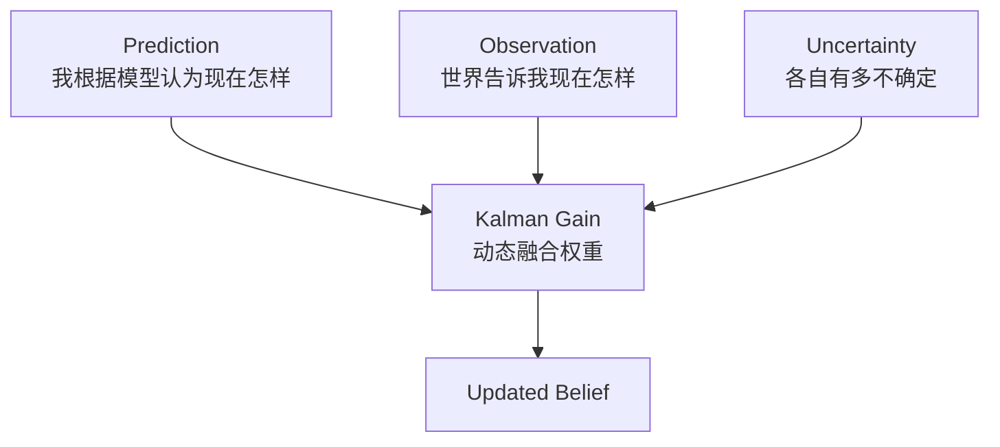

# Kalman Gain 的直觉

> 阅读定位：本部分以直觉和问题拆解为主。涉及具体滤波公式时，应同时确认模型、噪声和独立性假设；严格推导将随 Part II 整理补充。

## 本章目标

本章不写矩阵、不写高斯、不写协方差公式，只做一件事：

> 作为一个科学家，设计一种合理的信息融合规则。

重点不是记住 Kalman Filter，而是理解它为什么几乎必然会出现。

---

## 本章位置

Chapter 7 已经提出：机器人需要判断何时更相信 Prediction，何时更相信 Observation。本章正式推导融合规则：



---

## 核心问题

### Prediction 和 Observation 不一致时怎么办？

假设：

```text
Prediction: 10m
Observation: 12m
```

机器人不能简单取平均，因为 Prediction 和 Observation 的可靠性可能不同。真正决定融合权重的是它们各自的不确定性。

---

## 正文

### 1. 平均数为什么不够

如果 Prediction 来自 Encoder，Observation 来自 Camera，为什么一定 `50% / 50%`？

可能是：

```text
Prediction 70%，Observation 30%
```

也可能是：

```text
Prediction 10%，Observation 90%
```

因此，平均数不是根本答案。

### 2. 什么时候该相信谁

几个极端例子：

| Prediction | Observation | 合理直觉 |
| --- | --- | --- |
| `10m ±100m` | `12m ±1cm` | 几乎相信 Observation |
| `10m ±1cm` | `12m ±100m` | 几乎相信 Prediction |
| `10m ±1m` | `12m ±1m` | 融合到中间 |

这说明：

> 可信度越高，话语权越大。

### 3. Kalman Gain 的直觉定义

教材常把 Kalman Gain 写成公式，但直觉上它回答的是：

> 这一刻，Observation 能够给 Prediction 带来多少新的信息？

它不是单纯“偏向 Observation 的程度”，而是动态评估 Observation 对当前 Belief 的信息贡献。

### 4. Kalman 是动态权重调整器

Prediction 的不确定性不是固定的。预测越久，通常越不确定；遇到地毯、打滑或模型失配，Prediction 也会变差。

Observation 的不确定性也不是固定的。Camera 在白天、夜晚、逆光、玻璃、黑瓷砖下可靠性不同。

因此机器人每一帧都要重新计算融合权重。

### 5. Kalman Filter 的三句话

可以用三句话理解：

| 组件 | 回答的问题 |
| --- | --- |
| Prediction | 如果世界按照我的模型运行，现在应该是什么样？ |
| Observation | 现实世界告诉我，现在是什么样？ |
| Kalman Gain | 这一刻，我到底更应该相信哪一边？ |

---

## 关键直觉

### 1. Kalman 不是简单降噪

Kalman Filter 真正解决的是：

> 机器人如何在“相信自己”和“相信世界”之间找到动态平衡。

“自己”就是 Prediction，“世界”就是 Observation。

### 2. 融合不是二选一

即使 Observation 比 Prediction 差一点，也可能仍有信息。除非 Observation 几乎完全无效，否则不应该直接丢弃。

真正发生的是：

```text
每个信息源都说一点，机器人按可信程度综合。
```

### 3. Q 和 R 是对世界的理解

工程上很多时间花在调 `Q` 和 `R`：

| 量 | 直觉 |
| --- | --- |
| `Q` | Prediction / Motion Model 的不确定性 |
| `R` | Observation / Sensor 的不确定性 |

黑瓷砖导致视觉观测变差，`R` 应变大；地毯导致 Encoder 打滑，`Q` 应变大。

这些不是纯数学参数，而是你对世界和传感器的理解。

---

## 学习中的问题


<details>

<summary>Q1：为什么不是选择不确定性更小的那个？</summary>

因为另一个信息源即使不确定性更大，也可能仍包含新信息。状态估计不是硬选择，而是加权综合。

</details>

<details>

<summary>Q2：Kalman Gain 小是否说明 Observation 很差？</summary>

不一定。也可能是 Prediction 已经非常确定，Observation 虽然还可以，但没有提供多少新的 Information Gain。

</details>

<details>

<summary>Q3：如果 Prediction 来自 Transformer，Observation 来自 Camera，Kalman 思想还成立吗？</summary>

直觉上仍然成立。只要存在两个信息源：一个提供预测，一个提供观测，并且都带有不确定性，就仍然会遇到“如何动态融合”的问题。

---

</details>

## 本章小结

1. Kalman Filter 的起点是 Prediction 和 Observation 不一致。
2. 平均数不合理，因为不同信息源可靠性不同。
3. 融合权重由不确定性和信息增益决定。
4. Kalman Gain 回答 Observation 能给 Prediction 带来多少新信息。
5. Kalman Filter 可以理解为持续评估“更相信自己还是更相信世界”的系统。
6. 在写公式前，State、Belief、Prediction、Observation、Model、Information Gain 已经把 Kalman 的问题结构推出来了。

---

## 课后任务

把 Ground Detection 当成一个 State Estimation Problem，思考：

1. State 应该是什么？
2. Observation 是什么？
3. Prediction Model 是什么？
4. Correction 来自哪里？
5. 如何评估 Prediction 和 Observation 的不确定性？

---

## 下一章

[Week 1 Summary：课程总结与 Week 2 调整](summary.md)

Week 1 结束后，课程将进入 `Probabilistic State Estimation`：Information、Probability、Uncertainty、Gaussian、Bayes Filter、Kalman Filter。

## 相关笔记

- [Week 1 Chapter 7：如果世界上还没有 Kalman Filter，你会怎么设计一个机器人？](prediction-and-correction.md)
- 可后续沉淀概念：Kalman Gain、Q/R、Uncertainty Modeling、Belief Update
