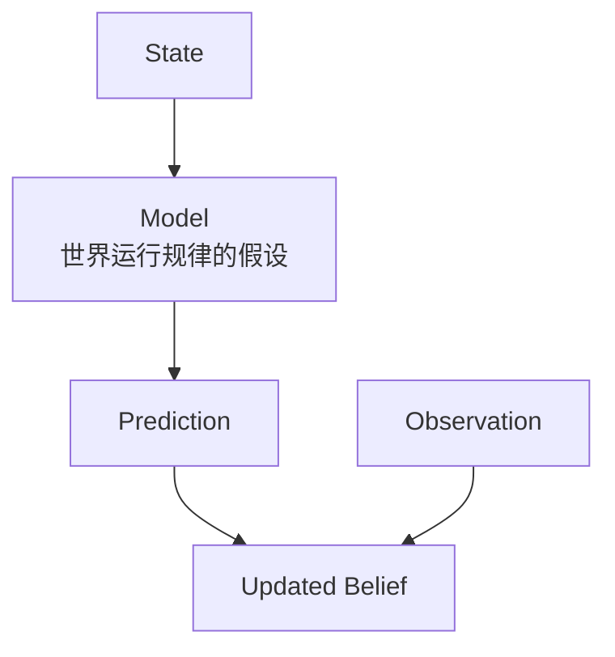
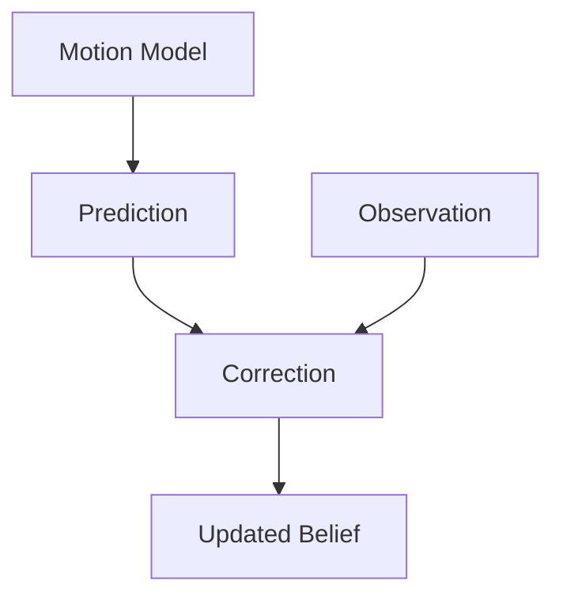
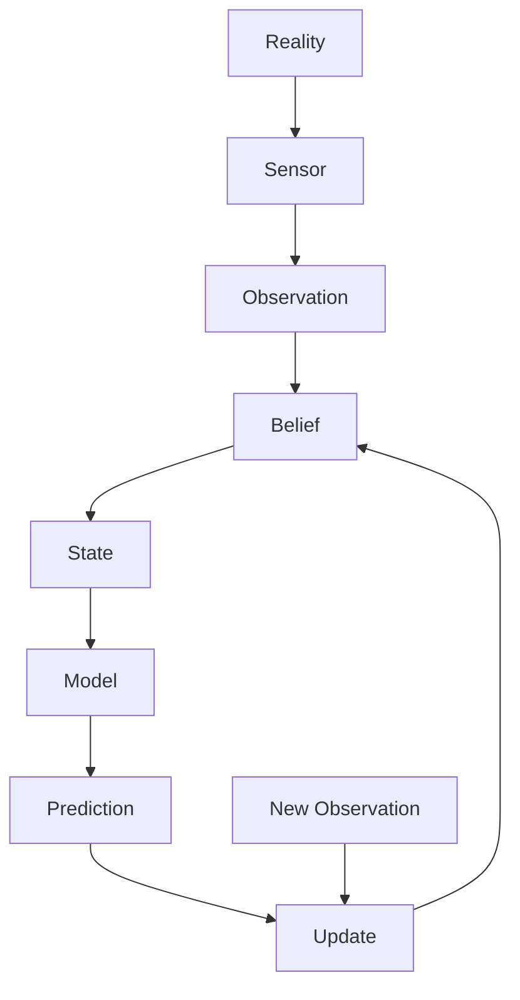

# 从状态到模型

> 阅读定位：本部分以直觉和问题拆解为主。涉及具体滤波公式时，应同时确认模型、噪声和独立性假设；严格推导将随 Part II 整理补充。

## 本章目标

本章先暂时放下 Kalman、Particle、ICP 和 SLAM，回答：

> 机器人为什么需要 Model？

核心观点：

> Model = 机器人对世界运行规律的假设。

---

## 本章位置

Chapter 5.5 定义了 State。Chapter 6 进一步说明：State 只有放进 Model 中，才能产生 Prediction。



---

## 核心问题

### 什么叫 Model？

很多教材从矩阵公式开始：

```text
x(k+1) = A x(k) + B u(k)
```

但在机器人系统里，Model 首先不是数学形式，而是对世界的假设。

例如扫地机器人预测下一秒 Pose 时，默认：

```text
机器人不会瞬移。
速度和位置是连续变化的。
轮子运动和机体运动有某种关系。
```

这些都是 Model。

---

## 正文

### 1. 为什么必须建模

如果只给机器人连续图像：

```text
Image -> Image -> Image
```

没有 State，也没有 Model，机器人就不知道如何预测未来。

Model 把“观测到的数据”转化为“可解释、可预测的世界结构”。

### 2. 好 Model 的两个要求

一个 Model 如果说“下一秒完全随机”，就无法预测；如果说“机器人永远直线运动”，又太不真实。

好的 Model 要同时满足：

| 要求 | 含义 |
| --- | --- |
| 足够简单 | 可以计算、可以推理、可以用于工程实现 |
| 足够真实 | 能覆盖关键物理规律和任务约束 |

这就是机器人建模中的核心 Trade-off。

### 3. Ground Detection 也是 Modeling

在 Ground Detection 中，用 Plane 表示地面，本质上就是 Model：

```text
Ground = Plane
```

这背后的假设是：

```text
局部地面近似平坦。
```

白瓷砖、黑瓷砖、低纹理或反光场景失败时，不只是参数问题，也可能是 Observation 开始违背 Model，或者 Model 过于简单。

### 4. Kalman 为什么是 Prediction 再 Correction

Kalman 的 Prediction 来自 Model，Observation 来自 Sensor，Correction 则让 Model 预测重新贴近观测世界。



所以 Kalman 不是先有公式，再有 Prediction / Correction；而是因为机器人相信某个 Model，才会先预测，再用观测修正。

### 5. 所有机器人算法都在验证 Model

机器人系统可以抽象为：



机器人不断循环：

```text
Prediction -> Observation -> Update -> Next Prediction
```

每一次循环，本质上都在检验自己的 Model 是否还能解释世界。

---

## 关键直觉

### 1. Algorithm solves a Model

> Algorithm solves a Model, but Intelligence comes from the Model itself.

算法只是模型的求解器。Kalman、EKF、UKF、Particle Filter 都可以替换，但 Model 错了，求解器再漂亮也会失败。

### 2. 真正优秀的机器人算法工程师先问 Model 对不对

工程上很多问题不是“滤波器写错了”，而是：

- State 设计不完整
- Observation Model 不符合场景
- Motion Model 忽略了关键物理因素
- 不确定性建模不合理

### 3. State Design 是建模的一部分

为什么 Kalman 的 State 里常放 Position 和 Velocity，而不是 Temperature 或 Logo？不是数学决定的，而是任务和物理决定的。

机器人建模一直在问：

> 为了预测未来，我到底需要保留哪些信息？

---

## 学习中的问题


<details>

<summary>Q1：Ground Detection 从“调参数”升级为“改 Model”是什么意思？</summary>

如果只是改阈值，是参数调整；如果加入 Confidence、Residual、Material、时序连续性或平面假设，就是在修改机器人对地面的 Model。

这会改变系统解释 Observation 的方式。

</details>

<details>

<summary>Q2：为什么 Model 是假设，不是 Truth？</summary>

因为 Model 永远是对真实世界的简化。`Ground = Plane` 在局部平坦地面上很好，但在台阶、地毯边缘、反光地面上可能失效。

机器人学的难点就是选择一个“足够简单又足够真实”的 Model。

---

</details>

## 本章小结

1. Model 是机器人对世界运行规律的假设。
2. Prediction 成立不是因为公式，而是因为 Model 捕捉了世界规律。
3. 好 Model 需要在简单和真实之间取舍。
4. Kalman 的 Prediction / Correction 可以看成 Model 和 Observation 的持续对齐。
5. 算法是求解器，真正决定系统上限的是 Model。

---

## 课后任务

1. 为 Ground Detection 写出一个你当前使用的 Model，并列出它的假设。
2. 举例说明一个“模型很简单但不真实”的机器人 Model。
3. 思考：如果 Observation 很好但 Model 很差，系统会出现什么问题？

---

## 下一章

[Week 1 Chapter 7：如果世界上还没有 Kalman Filter，你会怎么设计一个机器人？](prediction-and-correction.md)

下一章从世界规律、State、Observation 和 Model 出发，手工推导出机器人状态估计的底层循环。

## 相关笔记

- [Week 1 Chapter 5.5：为什么机器人能够利用时间？](state-and-time.md)
- 可后续沉淀概念：Model、State Design、Motion Model、Observation Model、Uncertainty Model
