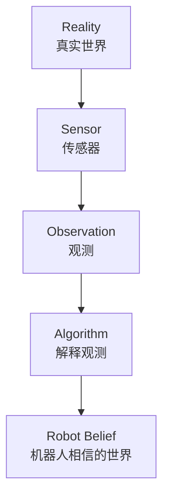
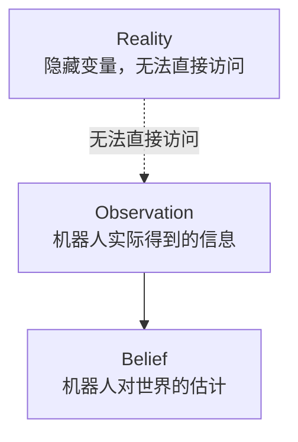
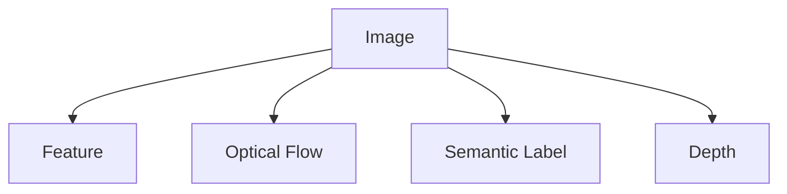
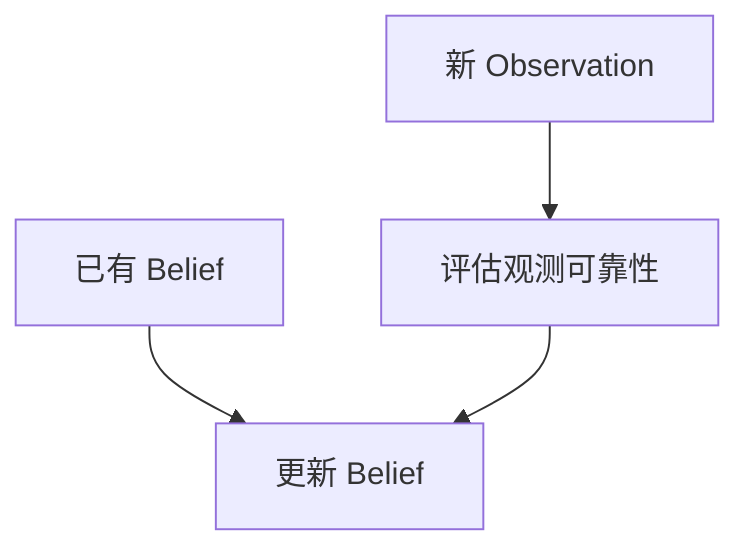

# 观测、真实世界与 Belief

> 阅读定位：本部分以直觉和问题拆解为主。涉及具体滤波公式时，应同时确认模型、噪声和独立性假设；严格推导将随 Part II 整理补充。

## 本章目标

本章回答一个更根本的问题：

> 如果所有传感器都会骗人，机器人还能相信什么？

这一章把思维从“传感器输出事实”推进到“传感器只提供观测，机器人维护 Belief”。

---

## 本章位置

Chapter 2 说明了单靠运动估计会累计误差。Chapter 3 开始处理多信息源的问题：



机器人真正工作的对象不是 `Reality`，而是它根据 Observation 构造出来的 `Belief`。

---

## 核心问题

### 传感器会告诉机器人“事实”吗？

不会。

Camera 输出的是像素，LiDAR 输出的是距离或点云，Encoder 输出的是轮子转动。它们从来不直接告诉机器人：

```text
这是桌子。
前面有墙。
我已经走了 1m。
```

这些结论都是机器人根据观测推断出来的。

因此本章的第一条关键结论是：

> 机器人永远只能获得 Observation，而不是 Truth。

---

## 正文

### 1. Observation 与 Reality 的距离

真实世界里可能有一张桌子，但 Camera 因为逆光只输出一片黑。站在人类角度看，机器人判断错了；但站在机器人角度，它只能根据观测做判断。

所以机器人永远生活在自己的 Belief 里，而不是我们认为的真实世界里。

更准确地说：



### 2. 为什么不能固定相信某个传感器

Camera 可能被逆光、黑暗、模糊、遮挡欺骗；LiDAR 可能被玻璃、反射、稀疏结构影响；Encoder 会受打滑影响。

机器人不能固定相信某一个传感器，而必须根据当前情境动态判断信息可靠性。

例如：

| 场景 | 更可靠的信息 |
| --- | --- |
| 逆光导致图像质量差 | Encoder / LiDAR 可能更可靠 |
| 湿滑地面导致轮子打滑 | Camera / LiDAR 可能更可靠 |
| 白墙缺乏纹理和几何特征 | 运动模型或历史 Belief 更重要 |

### 3. Information Fusion 不是 Sensor Fusion

很多文章把多传感器融合理解成 `Camera + LiDAR + IMU`。但真正被融合的不是硬件，而是信息。

同一个 Camera 就可以产生多种信息：



因此更准确的说法是：

> Information Fusion = 把不同来源、不同可靠性的信息综合起来，形成当前最合理的世界模型。

### 4. Belief 取代 True / False

机器人内部通常不是简单保存“真”或“假”，而是保存“相信多少”。

例如 Camera 说前面有墙，LiDAR 说没有墙，机器人不会简单判定谁对谁错，而是更新：

```text
Belief(前面有墙) = 0.82
```

或者在新观测后下降为：

```text
0.82 -> 0.65 -> 0.31
```

这就是从传统程序世界进入概率机器人学的入口。

---

## 关键直觉

### 1. 机器人不是寻找真相，而是寻找最可信解释

> 机器人不是在寻找真相，而是在所有不确定的信息中，寻找最可信的解释。

EKF、Particle Filter、Graph Optimization、Bundle Adjustment 都可以放在这句话下面理解。

### 2. Reality 对机器人是隐藏变量

机器人不能直接访问真实世界。它拥有的只有 Observation，并根据 Observation 更新 Belief。

这也是机器人学和传统程序的差异：排序算法有明确输入输出对错，而机器人面对的是隐藏的 Reality 和有噪声的 Observation。

### 3. 不要只看最大概率

机器人真正维护的是整个概率分布，而不只是“概率最大的答案”。

例如：

```text
位置 A：49%
位置 B：48%
位置 C：3%
```

如果只选 A，会丢掉 B 几乎同样可能这一重要信息。很多机器人算法真正维护的是整组可能性。

---

## 学习中的问题


<details>

<summary>Q1：Camera 看到墙，LiDAR 没测到墙，机器人应该相信谁？</summary>

不能简单回答“融合”。真正的问题是：

> 机器人凭什么决定哪条信息更值得相信？

它需要考虑传感器当前条件、历史 Belief、环境先验、观测质量、模型预测和不确定性。这个问题会引出概率、Belief 和后续 Kalman Gain。

</details>

<details>

<summary>Q2：Belief 应该立刻清零，还是逐渐变化？</summary>

如果机器人原来高度相信前方有墙，突然一帧 Camera 看不到墙，Belief 不应立刻变成 `0`。更合理的做法是根据观测可靠性和历史信息逐步更新。

这就是 Bayesian Thinking 的入口：



---

</details>

## 本章小结

1. 传感器提供的是 Observation，不是 Truth。
2. 机器人维护的是 Belief，而不是绝对真实世界。
3. Information Fusion 融合的是信息，不只是硬件传感器。
4. Belief 是对 Reality 的概率性估计，且需要根据新 Observation 持续更新。
5. 现代概率机器人学的核心思想是：Observation 永远不等于 Truth。

---

## 课后任务

1. 解释 `Observation`、`Reality`、`Belief` 三者的区别。
2. 思考：为什么“Camera + LiDAR + IMU”不等于真正的信息融合？
3. 用一个工程例子说明：为什么概率最大的答案不一定足够？

---

## 下一章

[Week 1 Chapter 4：为什么机器人维护的是一个概率分布，而不是一个位置？](belief-over-pose.md)

下一章进一步讨论：为什么 Localization 维护的是 Belief over Pose，而不是单个 Pose。

## 相关笔记

- [Week 1 Chapter 2：为什么机器人会迷路？](odometry-and-drift.md)
- 可后续沉淀概念：Observation、Reality、Belief、Information Fusion、Point Cloud
