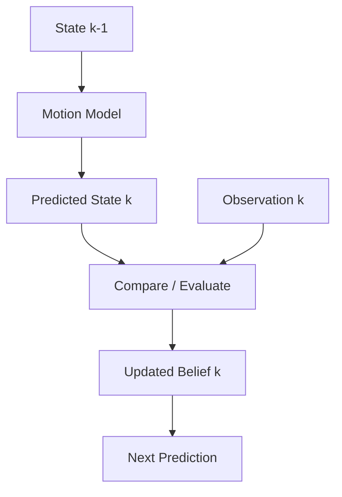
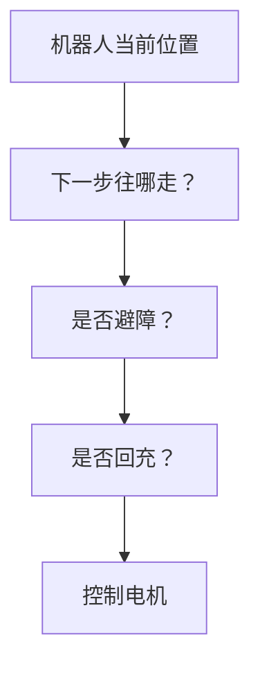
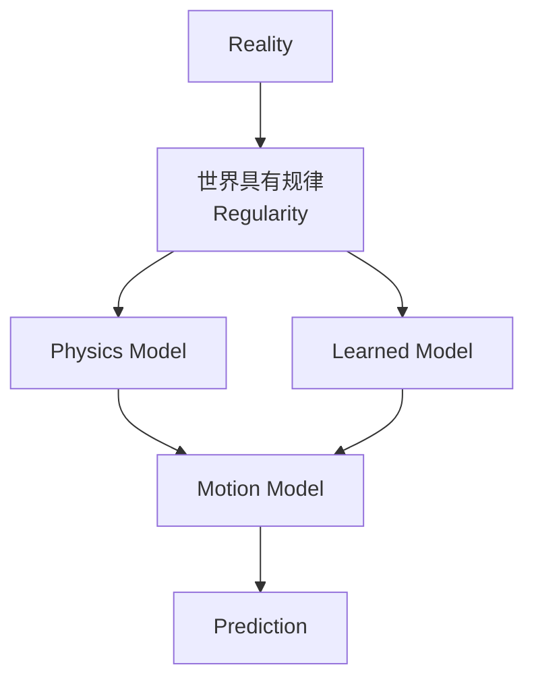

# 预测与校正的循环

> 阅读定位：本部分以直觉和问题拆解为主。涉及具体滤波公式时，应同时确认模型、噪声和独立性假设；严格推导将随 Part II 整理补充。

## 本章目标

本章暂时禁止使用 Kalman Filter、Particle Filter、EKF、Bayes Filter 和 SLAM 这些现成名词，假设自己是第一个机器人科学家：

> 如何设计一个能够持续知道自己位置的机器人？

目标不是背算法，而是从问题本身推导出状态估计循环。

---

## 本章位置

Chapter 6 讲 Model。本章从 Model 出发，推导状态估计最底层的循环：



这里还没有 Kalman，但 Kalman、Particle、SLAM 的雏形已经出现。

---

## 核心问题

### 机器人真正要做的是定位吗？

定位不是最终目的。机器人真正要做的是持续做出正确决策。

例如扫地机器人：



定位只是为了支持 Planning、避障、回充和控制。

---

## 正文

### 1. 第一步：设计 State

如果 State 只有：

```text
x, y, theta
```

机器人很难预测 `100ms` 后的位置，因为缺少速度信息。

因此 State 可能升级为：

```text
x, y, theta, vx, vy, omega
```

State 不是拍脑袋选的，而是：

> 预测未来需要什么，就加入什么。

### 2. 第二步：区分 State 和 Observation

机器人不能直接知道 State，只能得到 Observation：

| 传感器 | Observation |
| --- | --- |
| Encoder | Wheel Rotation |
| Camera | Image / Feature / Semantic |
| IMU | Acceleration / Angular Velocity |
| LiDAR | Range / Point Cloud |

Observation 只是关于 State 的证据，不是 State 本身。

### 3. 第三步：Prediction 为什么在前

机器人不是先看到世界再预测，而是先根据已有 Belief 和 Model 对世界形成预期，再用 Observation 检查预期。

生活中也类似：晚上回家开灯前，你已经预测沙发应该在左边；开灯后的 Observation 只是增强或修正这个 Belief。

> 人类也是 Prediction First。

### 4. Prediction 的根源是什么

Prediction 表面上来自 Motion Model，但更深层来自：

> 世界本身具有规律（Regularity）。

Physics Model 和 Learned Model 都是在逼近世界规律：



如果世界完全随机，Physics、Learning 和 Motion Model 都无法产生有效 Prediction。

### 5. Observation 和 Model 谁更重要

高质量 Observation 不等于信息多。白墙图像可能很清楚，但对 Localization 几乎没有区分能力。

强 Model 也可以从噪声 Observation 中恢复信息，例如 IMU 噪声大，但惯导能利用速度连续、位置连续、重力恒定等物理约束工作。

更准确的结论是：

> Observation 提供证据（Evidence），Model 提供解释（Explanation）。

机器人真正关注的是 Observation 和 Model 是否互补，是否带来 Information Gain。

---

## 关键直觉

### 1. Information Gain 比 Observation 质量更重要

如果 Prediction 已经非常确定：

```text
(5, 5) ± 1cm
```

而 Camera 给出：

```text
(5, 5) ± 10m
```

这个 Observation 可能没有多少价值。

反过来，如果 Prediction 很不确定，Observation 能显著缩小不确定性，它就有很高 Information Gain。

### 2. 不要二选一，要按信息贡献融合

Prediction 和 Observation 不一定谁完全替代谁。即使 Observation 比 Prediction 差一点，也可能包含新信息。

状态估计不是“选择谁”，而是“按可信程度和信息增益综合”。

### 3. Kalman Gain 的问题已经出现

本章最后的问题是：

> 机器人如何判断这一刻应该更相信 Model，还是更相信 Observation？

这不是一个简单工程参数，而是 Kalman Gain 存在的原因。

---

## 学习中的问题


<details>

<summary>Q1：Prediction 来自 Motion Model、Physics，还是 Learning？</summary>

它们都不是最根本来源。Prediction 的根本来源是世界具有规律。Physics 和 Learning 都只是试图逼近这些规律。

</details>

<details>

<summary>Q2：好的 Observation 能替代差的 Model 吗？</summary>

不能简单替代。Observation 决定机器人能看到什么，Model 决定机器人如何理解看到的东西。二者需要相互解释、相互纠错。

</details>

<details>

<summary>Q3：为什么“不确定性小”不等于“信息多”？</summary>

白墙图像可能噪声很小，但不能区分位置；它不一定提供 Localization 所需的信息。机器人真正关心的是新 Observation 能减少多少不确定性。

---

</details>

## 本章小结

1. 定位服务于决策，不是机器人最终目的。
2. State Design 来自预测未来的需要。
3. Observation 是 State 的证据，不是 State 本身。
4. Prediction 的根源是世界规律，而不只是 Motion Model。
5. Observation 和 Model 分别提供 Evidence 与 Explanation。
6. Information Gain 引出 Kalman Gain。

---

## 课后任务

1. 解释为什么白墙图像“质量高”但对 Localization 信息少。
2. 用自己的项目举例：Observation 和 Model 如何互相纠错？
3. 思考：Prediction 和 Observation 不一致时，机器人应该如何决定融合权重？

---

## 下一章

[Week 1 Chapter 8：如果世界上没有 Kalman Filter，我们能不能自己推导出来？](kalman-gain-intuition.md)

下一章正式用直觉推导 Kalman Filter 的融合规则。

## 相关笔记

- [Week 1 Chapter 6：为什么机器人学本质上是一门建模的学科？](modeling.md)
- 可后续沉淀概念：Information Gain、Prediction、Observation、Physics Model、Learned Model
