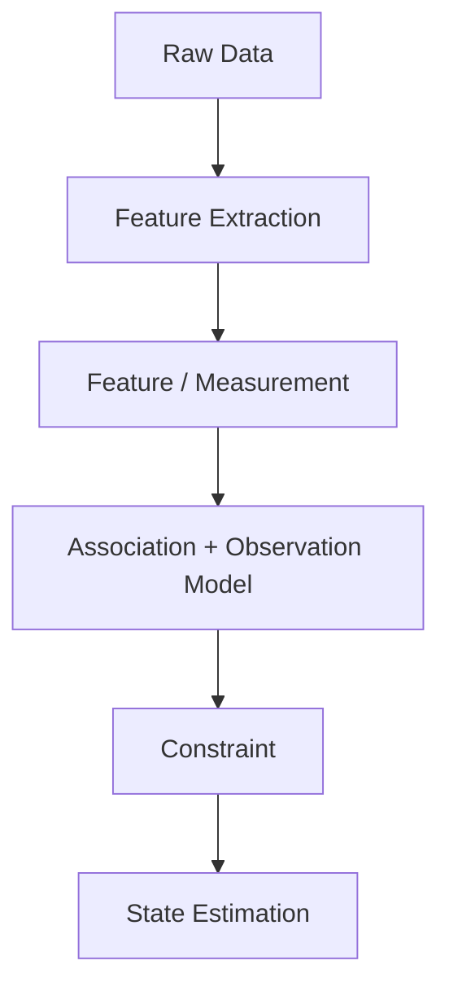
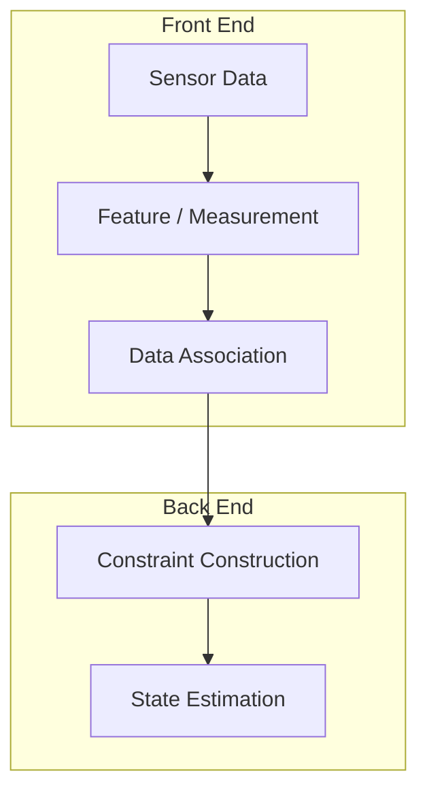

# 从 Data 到 Constraint

## 本章目标

- 澄清 Data、Feature、Observation 与 Constraint 的层次
- 保留“提纯”直觉，同时修正其边界
- 连接感知前端与状态估计后端

## 本章位置

## 核心问题

### Observation 是对 Data 的“提纯”吗？

这个直觉有价值：处理过程会去掉大量与当前任务无关的细节。但更准确地说，它不是寻找 Data 中唯一纯净的 Truth，而是根据 State、任务和模型构造可用于估计的 Measurement 或 Constraint。

## 正文

### 1. 四个层次

| 层次 | 回答的问题 | 示例 |
| --- | --- | --- |
| Data | 传感器记录了什么？ | 图像像素、点云、IMU 读数 |
| Feature | 哪些可重复结构值得描述？ | 角点、平面、线段 |
| Observation | 当前传感器测到了什么量？ | 像素坐标、距离、角度 |
| Constraint | 该测量如何限制 State？ | 重投影误差、点面距离 |

Feature 与 Observation 在不同系统中可能重叠，关键是明确接口，而不是争夺唯一术语。

### 2. Constraint 由模型产生

以视觉重投影为例：图像 Feature 本身不是位姿约束。结合 Landmark、相机模型与数据关联后，才能写出：

$$
\mathbf{z}_i = h(\mathbf{x}, \mathbf{m}_i) + \mathbf{v}_i
$$

进而形成 Residual：

$$
\mathbf{r}_i
=
\mathbf{z}_i - h(\mathbf{x}, \mathbf{m}_i)
$$

这里 $$mathbf{x}$$ 是机器人状态，$$mathbf{m}_i$$ 是地图特征，$$mathbf{z}_i$$ 是测量，$$h$$ 是观测模型。

### 3. “提纯”的正确边界

处理链通常会：

- 删除与任务无关的自由度
- 压缩高维 Data
- 增强可重复结构
- 引入模型假设和表示偏好
- 可能丢失后续任务需要的信息

因此 Refinement 同时包含提取与舍弃。对定位最好的表示，不一定对语义理解或避障最好。

### 4. 前端与后端

这个划分是常见工程抽象，不是绝对边界。有些 Direct Method 直接从像素构造残差，并不显式输出传统 Feature。

## 关键直觉

> **导师提示**
> Sensor 给出 Data；任务决定哪些变化重要；Model 把选出的 Measurement 变成对 State 的 Constraint。

## 易混点

- Feature 不天然等于 Information；重复 Feature 可能没有区分力。
- Observation Model 不只是降噪器，它定义 State 与 Measurement 的关系。
- 数据压缩并不保证信息保留，是否有损取决于任务。

## 本章小结

$$
\boxed{
\text{Data}
\rightarrow
\text{Measurement}
\rightarrow
\text{Constraint on State}
}
$$

本章是由 Observation Validation 进入 Constraint 的桥梁，因此保留为 Chapter 11.5。

## 思考题

### 思考题 1

为什么同一张图像可以为不同任务生成不同 Observation？

参考答案

因为任务选择不同 State 和约束。定位可能关心像素对应关系，避障关心深度和占据，语义理解关心类别与实例。

## 下一章

[Week 2 Chapter 12：Constraint 为什么是机器人估计的语言？](constraints.md)
