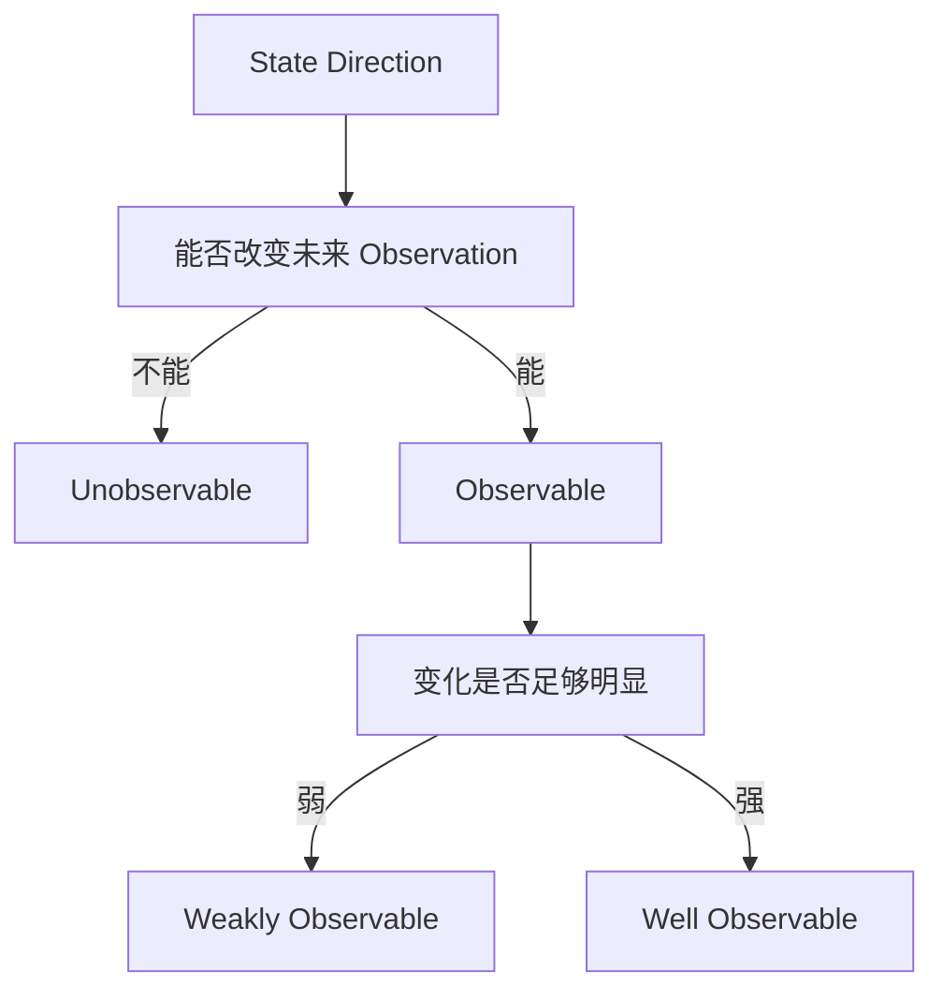

# 可观测性与信息强度

## 本章目标

- 区分 Directly Observed、Observable 与 Well Observable
- 推导线性系统的可观测性矩阵
- 理解 Gramian、特征值与弱方向

## 基本模型

$$
\mathbf x_{t+1}=\mathbf F\mathbf x_t,qquad
\mathbf z_t=\mathbf H\mathbf x_t
$$

连续观测为：

$$
\begin{aligned}
\mathbf z_0&=\mathbf H\mathbf x_0\\
\mathbf z_1&=\mathbf H\mathbf F\mathbf x_0\\
\mathbf z_2&=\mathbf H\mathbf F^2\mathbf x_0
\end{aligned}
$$

堆叠后：

$$
\begin{bmatrix}\mathbf z_0\\\mathbf z_1\\\vdots\\\mathbf z_{n-1}\end{bmatrix}
=
\underbrace{\begin{bmatrix}
\mathbf H\\\mathbf H\mathbf F\\\vdots\\\mathbf H\mathbf F^{n-1}
\end{bmatrix}}_{\mathcal O}
\mathbf x_0
$$

若状态维度为 $$n$$ 且 $$\operatorname{rank}(\mathcal O)=n$$，线性时不变系统可观测。

## 位置-速度例子

$$
\mathbf F=\begin{bmatrix}1&\Delta t\\0&1\end{bmatrix},qquad
\mathbf H=\begin{bmatrix}1&0\end{bmatrix}
$$

$$
\mathcal O=
\begin{bmatrix}
1&0\\
1&\Delta t
\end{bmatrix}
$$

$$\Delta t\neq0$$ 时 Rank 为 2，所以速度虽然未被直接测量，仍可通过位置随时间的变化被估计。

## Observable 不等于信息很强

Rank Test 只回答理论上能否区分所有 State Direction，不回答问题是否数值稳定。有限时间窗内可定义 Observability Gramian：

$$
\mathbf W_o=\sum_{k=0}^{T-1}(\mathbf F^k)^\top
\mathbf H^\top\mathbf R^{-1}\mathbf H\mathbf F^k
$$

小特征值对应弱约束方向；条件数很大表示不同方向的信息强度悬殊。Measurement Noise、频率、轨迹和几何结构都会影响实际估计质量。

## SLAM 中的不可观测性

没有绝对参考时，全局平移和全局旋转常是 Gauge Freedom：许多整体变换后的轨迹与地图产生同样的相对 Observation。固定首帧或添加 Prior 是选择参考系，不是传感器凭空观测到了绝对自由度。

## 关键直觉

> **导师提示**
> 可观测性问“能不能知道”，Information Strength 问“要付出多大代价才能知道得稳定”。

## 易混点

- Covariance 小不证明真实系统可观测，错误模型也会产生虚假自信。
- 增加 Measurement Frequency 通常有帮助，但高度相关的重复测量不能按独立信息简单累加。
- Motion 可以主动改善几何条件，因此 Observability 与 Active Perception 紧密相连。

## 思考题

### 思考题 1

为什么只原地旋转的相机难以恢复尺度？

参考答案

缺少平移视差时，不同深度可能产生相同或近似的角度 Observation，尺度方向无法被充分区分。

## 下一章

[Week 2 Chapter 20：Jacobian 与 Linearization](jacobian.md)
