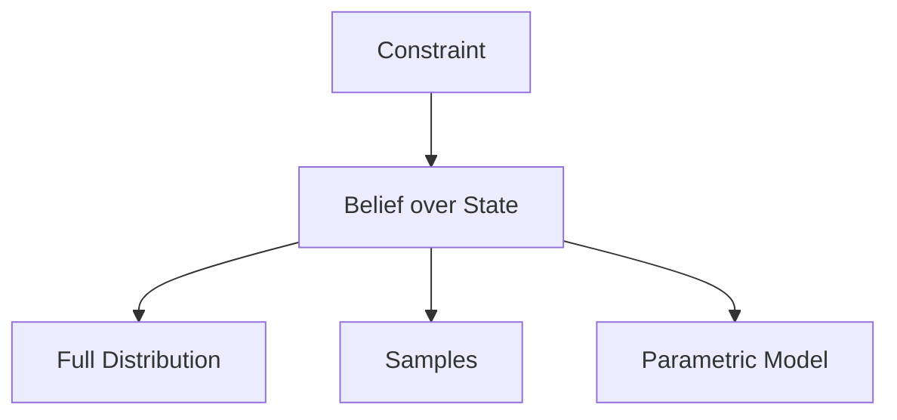

# 从最佳估计到概率分布

## 本章目标

- 区分 State、Estimate 与 Belief
- 理解单点估计丢失了什么
- 比较分布、样本和参数化 Belief 表示

## 本章位置

## 核心问题

真实状态 $$x$$ 是未知物理量，$$\hat{x}$$ 是算法选出的代表值，而 Belief 是机器人对所有可能 $$x$$ 的相信程度：

$$
bel(x_t)=p(x_t\mid z_{1:t},u_{1:t})
$$

## 正文

### 1. 为什么 Best Estimate 不完整

单点 $$\hat{x}=10$$ 没有说明：附近状态是否也可能、是否存在另一个峰、系统是否过度自信。决策需要的不只是“最好的答案”，还包括其他假设的概率结构。

### 2. Belief 的三种常见表示

| 表示 | 保存内容 | 优势 | 限制 |
| --- | --- | --- | --- |
| Histogram | 离散网格上的概率 | 直观、可多峰 | 维度灾难 |
| Particles | 带权样本 | 灵活、可多峰 | 有采样误差和退化 |
| Gaussian | Mean 与 Covariance | 紧凑、计算高效 | 难表达偏态与多峰 |

这些方法不是不同 Truth，而是对同一个 Belief 的不同计算表示。

### 3. 从 Belief 到单点决策

常见选择包括：

- **MAP**：$$\hat{x}_{MAP}=\arg\max_x p(x)$$
- **Mean**：$$\hat{x}=\mathbb{E}[x]$$
- **保留多假设**：暂不压缩成一个点

多峰分布中，Mean 可能落在低概率区域；MAP 又会丢弃次要但重要的假设。选择必须结合损失函数和任务风险。

### 4. 表示选择是一种建模决定

应依次考虑：Belief 是否多峰、State 维度、模型非线性、实时预算、是否有良好初值，以及错误决策的代价。

> **导师提示**
> Filter 的第一选择题不是“哪个算法更高级”，而是“当前 Belief 长什么样，允许怎样压缩”。

## 易混点

- Probability Density 可以大于 1；真正的概率是区间积分。
- Mean 不一定是最可能状态。
- 多个 Hypothesis 不等于多个独立 Truth，而是系统尚未消除的解释。

## 本章小结

$$
\boxed{\text{State Estimation maintains a belief, not merely a point.}}
$$

## 思考题

### 思考题 1

对称双峰 Belief 为什么不适合直接输出 Mean？

参考答案

Mean 可能位于两个峰之间，而该位置本身概率很低。此时应保留多假设，或依据明确损失函数选择决策。

## 下一章

[Week 2 Chapter 14：为什么 Gaussian 如此常用？](gaussian.md)
