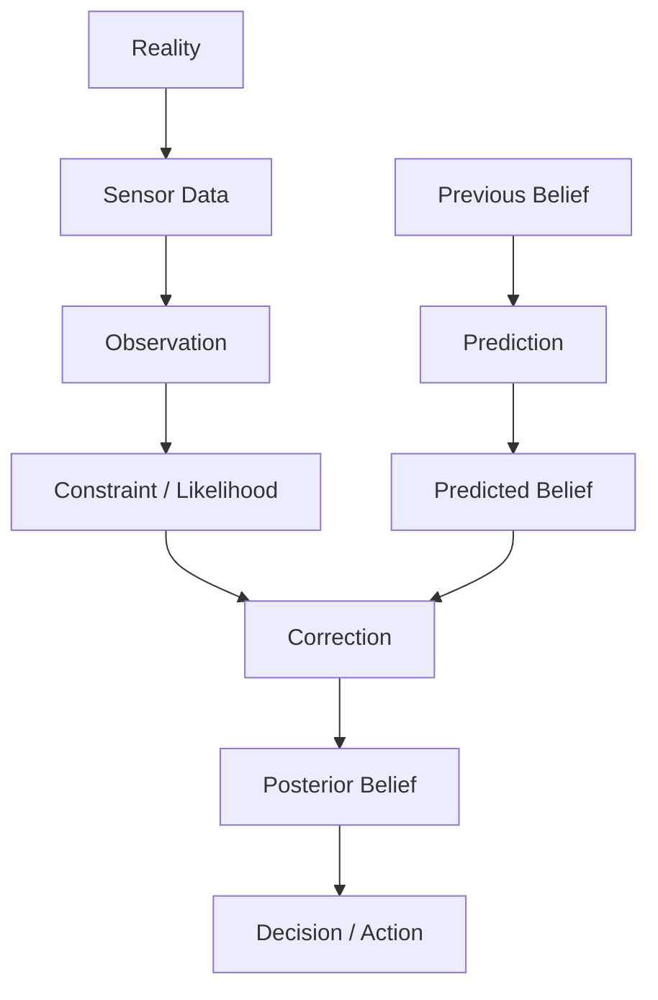

# Part II 回顾与自测

## 本周定位

Week 1 建立机器人世界观；Week 2 把 State、Observation、Belief、Prediction 和 Correction 写成可计算的概率状态估计框架。

## 实际学习轨迹

| Chapter | 主题 | 建立的能力 |
| --- | --- | --- |
| 9 | Information | 用不确定性下降判断信息价值 |
| 10 | Uncertainty | 区分 Error、Noise 与 Uncertainty |
| 11 | Observation Validation | 用 Innovation 与 Gating 判断一致性 |
| 11.5 | Data to Constraint | 连接感知前端与估计后端 |
| 12 | Constraint | 用模型把 Observation 变成状态约束 |
| 13 | Belief Representation | 比较分布、样本与参数化表示 |
| 14 | Gaussian | 用 Mean 与 Covariance 压缩 Belief |
| 15 | Bayes Filter | 建立 Prediction / Correction 母框架 |
| 16 | Kalman Filter | 推导线性 Gaussian 递归更新 |
| 17 | Position-Velocity KF | 理解协方差传播与间接更新 |
| 18-19 | Observability | 区分可观测与信息强度 |
| 20 | Jacobian | 局部线性化与敏感度 |
| 21 | EKF | 在当前估计附近处理非线性 |
| 22 | UKF | 用 Sigma Points 传播分布矩 |
| 23 | Non-Gaussian Filters | Histogram、Particle Filter 与方法选择 |

## 统一知识地图

## 十条核心结论

1. Data 只有改变 Belief 时才成为 Information。
2. 完整估计必须包含 Estimate 与 Uncertainty。
3. Observation 必须先经过模型和一致性检查再参与更新。
4. Constraint 表达 Observation 如何限制 State。
5. Bayes Filter 是各种递归滤波器的共同框架。
6. Gaussian 是高效 Belief Model，不是 Reality。
7. Covariance 同时描述尺度、方向和变量相关性。
8. Observable 不代表 Well Observable；Rank 与信息强度是不同问题。
9. Jacobian 是局部敏感度，不是全局线性关系。
10. 方法选择首先取决于 Belief 形状、State 维度、非线性和计算预算。

## 方法对照

| 方法 | 核心假设 | 主要优势 | 主要边界 |
| --- | --- | --- | --- |
| KF | 线性 Gaussian | 精确、高效 | 不处理一般非线性 |
| EKF | 局部一阶近似 | 实时、结构清晰 | 依赖线性化点 |
| UKF | 单 Gaussian | 无需 Jacobian | 仍不能表达多峰 |
| Histogram | 离散网格 | 完整、多峰 | 维度灾难 |
| Particle Filter | 样本近似 | 灵活、多峰 | 高维代价高、样本退化 |

## 进入下一阶段前的检查

- 能否从 Bayes Filter 推出 Prediction 与 Correction？
- 能否解释 $$Q$$、$$R$$、$$P$$、$$S$$ 和 $$K$$ 的角色？
- 能否从 $$F$$ 与 $$H$$ 构造线性系统的 Observability Matrix？
- 能否解释 Jacobian 为什么只在当前估计附近有效？
- 能否根据 Belief 是否多峰选择合适表示？

## 下一阶段

Part III 将进入 Spatial State Estimation，把概率估计框架应用到 Pose、Coordinate Frame、Rotation、Rigid Transform 与空间传感器模型。

## 相关笔记

- [Bayes Filter](bayes-filter.md)
- [Position-Velocity Kalman Filter](position-velocity-kf.md)
- [Observability 与 Information Strength](observability.md)
- [Non-Gaussian Filters 与方法选择](non-gaussian-filters.md)
