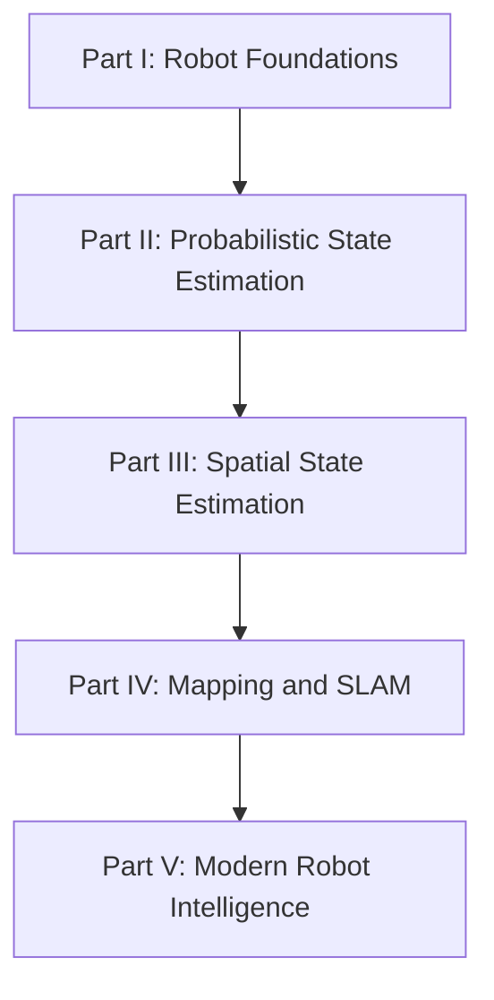

# 课程计划与学习轨迹

本时间表记录实际学习轨迹。已完成内容以真实 Chapter 为准；未来安排是方向性计划，可根据学习中的问题拆分、合并或调整。

## 课程设计

课程不直接从滤波公式开始，而是先建立机器人世界观，再进入概率数学和空间估计：

Part I 与 Part II 的边界是：Chapter 1–8 回答 State、Belief、Model 和 Kalman 为什么存在；Chapter 9 起正式量化 Information、Uncertainty 和 Belief。

## 已完成

### Week 1：Part I Robot Foundations

| Chapter | 实际主题 | 状态 |
| --- | --- | --- |
| 1 | 机器人系统与信息流 | 完成 |
| 2 | Odometry Error 与 Localization | 完成 |
| 3 | Observation、Reality 与 Belief | 完成 |
| 4 | Belief over Pose | 完成 |
| 5 | Bayesian Thinking | 完成 |
| 5.5 | 时间连续性、State 与 Markov Assumption | 完成 |
| 6 | Model 与 State Design | 完成 |
| 7 | Prediction / Correction 状态估计循环 | 完成 |
| 8 | Kalman Gain 直觉 | 完成 |

### Week 2：Part II Probabilistic State Estimation

| Chapter | 实际主题 | 状态 |
| --- | --- | --- |
| 9 | Information | 完成 |
| 10 | Uncertainty | 完成 |
| 11 | Observation Validation、Innovation 与 Gating | 完成 |
| 11.5 | Data、Feature、Observation 与 Constraint | 完成 |
| 12 | Constraint、Likelihood 与 Cost | 完成 |
| 13 | Belief Representation | 完成 |
| 14 | Gaussian、Mean 与 Covariance | 完成 |
| 15 | Bayes Filter | 完成 |
| 16 | 一维 Kalman Filter 推导 | 完成 |
| 17 | Position-Velocity Kalman Filter | 完成 |
| 18-19 | Observability 与 Information Strength | 完成 |
| 20 | Jacobian 与 Linearization | 完成 |
| 21 | Extended Kalman Filter | 完成 |
| 22 | Unscented Kalman Filter | 完成 |
| 23 | Non-Gaussian Filters 与方法选择 | 完成 |

### Week 3：Part III Spatial State Estimation

| Chapter | 实际主题 | 状态 |
| --- | --- | --- |
| 24 | [坐标系与坐标变换](spatial/coordinate-frames.md) | 完成 |
| 25 | [二维旋转与 SO(2)](spatial/so2.md) | 完成 |
| 26 | [二维位姿与 SE(2)](spatial/se2.md) | 完成 |
| 27 | [三维旋转与 SO(3)](spatial/so3.md) | 完成 |
| 28 | [四元数](spatial/quaternions.md) | 完成 |
| 29 | [三维位姿与 SE(3)](spatial/se3.md) | 完成 |
| 30 | [坐标系约定与变换调试](spatial/transform-debugging.md) | 完成 |
| 31 | [SE(3) 上的位姿不确定性](spatial/pose-uncertainty.md) | 完成 |
| 32 | [机器人运动模型](spatial/robot-motion-models.md) | 完成 |
| 33 | [传感器观测模型](spatial/sensor-models.md) | 完成 |
| 34 | [已知地图中的定位](spatial/localization.md) | 完成 |
| 35 | [数据关联](spatial/data-association.md) | 完成 |
| 36 | [扫描匹配与 ICP](spatial/scan-matching-icp.md) | 完成 |
| 阶段总结 | [Part III 回顾与自测](spatial/summary.md) | 完成 |

Chapter 31–36 按真实课堂内容完成整理。综合草稿按原课程编号拆成 Chapter 32–36，并把阶段回顾独立为总结页。Chapter 32 仅完成差速底盘模型；此前预告的 Ackermann 与全向底盘未展开，保留为后续补充方向。

### Week 4：Part IV Mapping and SLAM

| Chapter | 实际主题 | 状态 |
| --- | --- | --- |
| 37 | [SLAM 问题定义](mapping/slam-formulation.md) | 完成 |
| 38 | [Landmark SLAM 与 EKF-SLAM](mapping/ekf-slam.md) | 完成 |
| 39 | [SLAM 可观测性与 Gauge Freedom](mapping/gauge-freedom.md) | 完成 |
| 40 | [Visual SLAM 前端](mapping/visual-frontend.md) | 完成 |
| 41 | [关键帧与局部建图](mapping/keyframes-local-mapping.md) | 完成 |
| 42 | [非线性最小二乘](mapping/nonlinear-least-squares.md) | 完成 |
| 43 | [Bundle Adjustment](mapping/bundle-adjustment.md) | 完成 |
| 44 | [Factor Graph](mapping/factor-graphs.md) | 完成 |
| 45 | [Pose Graph Optimization](mapping/pose-graph.md) | 完成 |
| 46 | [回环检测与全局校正](mapping/loop-closure.md) | 完成 |
| 47 | [视觉／激光惯性状态估计](mapping/visual-lidar-inertial.md) | 完成 |
| 48 | [现代 SLAM 流程与系统设计](mapping/modern-slam-pipeline.md) | 完成 |
| 阶段总结 | [Part IV 回顾与自测](mapping/summary.md) | 完成 |

Chapter 37–48 按本次实际课程内容整理。Chapter 48 的系统设计保留为章节，Part IV 总回顾与八道综合自测独立为总结页；VIO/LIO 基础已在 Chapter 47 完成。

## 实际调整记录

- 原计划把 Coordinate Frames 放在 Week 2，实际延后到 Part III。
- 原计划将概率与滤波分散到 Week 5–8，实际集中提前到 Week 2。
- 根据课堂互动新增 Chapter 5.5 与 Chapter 11.5。
- Observability 与 Information Strength 作为连续主题合并记录为 Chapter 18-19。
- Part III 综合讲解按 Chapter 32–36 分章整理，Scan Matching / ICP 的基础介绍已在 Chapter 36 完成；Part IV 再深入 SLAM 前端与后端集成。
- VIO/LIO 原属 Part V 的方向性计划，实际提前到 Part IV Chapter 47；后续课程方向移除已完成的 Part IV 与已学基础主题。
- Week 2 的实际密度远高于最初按自然周划分的计划；`Week` 在这里表示学习阶段，不强制等于七个自然日。

下一阶段进入 Part V：从动态／语义 SLAM 与现代场景表示开始，再学习 World Model 和 Embodied AI；具体章节编号按实际学习确定。VIO/LIO 已完成基础讲解，可按需要继续深化。

## 后续课程方向

| Part | 目标 | 暂定主题 |
| --- | --- | --- |
| V | Modern Robot Intelligence | Dynamic/Semantic SLAM、NeRF、3DGS、World Model、Embodied AI |

## 每阶段固定产出

- 整理后的 Chapter 笔记
- 阶段 Summary 与知识地图
- 实际时间表更新
- 可进一步沉淀的 Concept 标记
- 思考题与可折叠参考答案
