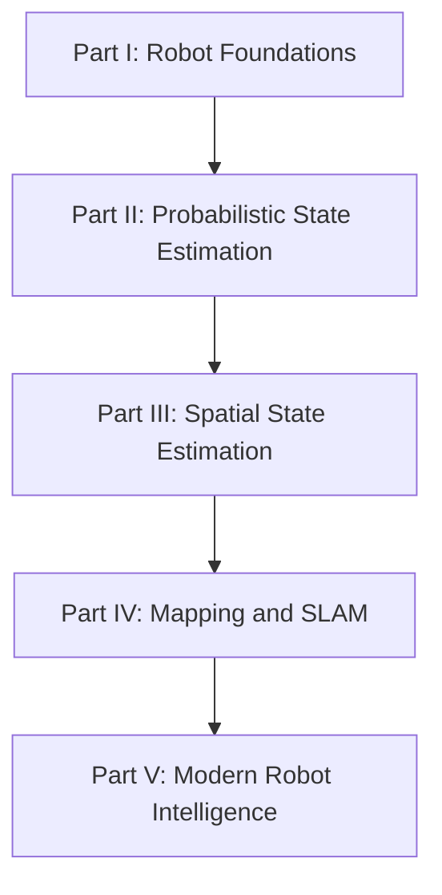

# 课程计划与学习轨迹

本时间表记录实际学习轨迹。已完成内容以真实 Chapter 为准；未来安排是方向性计划，可根据学习中的问题拆分、合并或调整。

## 课程设计

课程不直接从滤波公式开始，而是先建立机器人世界观，再进入概率数学和空间估计：

Part I 与 Part II 的边界是：Chapter 1–8 回答 State、Belief、Model 和 Kalman 为什么存在；Chapter 9 起正式量化 Information、Uncertainty 和 Belief。

## 已完成

### Week 1：Part I Robot Foundations

| Chapter | 实际主题 | 状态 |
| --- | --- | --- |
| 1 | 机器人系统与信息流 | 完成 |
| 2 | Odometry Error 与 Localization | 完成 |
| 3 | Observation、Reality 与 Belief | 完成 |
| 4 | Belief over Pose | 完成 |
| 5 | Bayesian Thinking | 完成 |
| 5.5 | 时间连续性、State 与 Markov Assumption | 新增并完成 |
| 6 | Model 与 State Design | 完成 |
| 7 | Prediction / Correction 状态估计循环 | 完成 |
| 8 | Kalman Gain 直觉 | 完成 |

### Week 2：Part II Probabilistic State Estimation

| Chapter | 实际主题 | 状态 |
| --- | --- | --- |
| 9 | Information | 完成 |
| 10 | Uncertainty | 完成 |
| 11 | Observation Validation、Innovation 与 Gating | 完成 |
| 11.5 | Data、Feature、Observation 与 Constraint | 新增并完成 |
| 12 | Constraint、Likelihood 与 Cost | 完成 |
| 13 | Belief Representation | 完成 |
| 14 | Gaussian、Mean 与 Covariance | 完成 |
| 15 | Bayes Filter | 完成 |
| 16 | 一维 Kalman Filter 推导 | 完成 |
| 17 | Position-Velocity Kalman Filter | 完成 |
| 18-19 | Observability 与 Information Strength | 合并完成 |
| 20 | Jacobian 与 Linearization | 完成 |
| 21 | Extended Kalman Filter | 完成 |
| 22 | Unscented Kalman Filter | 完成 |
| 23 | Non-Gaussian Filters 与方法选择 | 完成 |

## 实际调整记录

- 原计划把 Coordinate Frames 放在 Week 2，实际延后到 Part III。
- 原计划将概率与滤波分散到 Week 5–8，实际集中提前到 Week 2。
- 根据课堂互动新增 Chapter 5.5 与 Chapter 11.5。
- Observability 与 Information Strength 作为连续主题合并记录为 Chapter 18-19。
- Week 2 的实际密度远高于最初按自然周划分的计划；`Week` 在这里表示学习阶段，不强制等于七个自然日。

## Part III 实际进度

| Chapter | 主题 | 状态 |
| --- | --- | --- |
| 24 | [坐标系与坐标变换](spatial/coordinate-frames.md) | 已有笔记已迁移 |
| 25 | [二维旋转与 SO(2)](spatial/so2.md) | 已有笔记已迁移 |
| 26 | [二维位姿与 SE(2)](spatial/se2.md) | 已有笔记已迁移 |
| 27 | [三维旋转与 SO(3)](spatial/so3.md) | 已有笔记已迁移 |
| 28 | [四元数](spatial/quaternions.md) | 已有笔记已迁移 |
| 29 | [三维位姿与 SE(3)](spatial/se3.md) | 已有笔记已迁移 |
| 30 | [坐标系约定与变换调试](spatial/transform-debugging.md) | 已有笔记已迁移 |

下一阶段从 Chapter 31 继续，主题以实际学习内容确定。

## 后续课程方向

| Part | 目标 | 暂定主题 |
| --- | --- | --- |
| III | Spatial State Estimation | Pose、坐标系、旋转、刚体变换、空间传感器模型 |
| IV | Mapping & SLAM | Scan Matching、Visual/LiDAR Odometry、Graph Optimization、Loop Closure、Mapping |
| V | Modern Robot Intelligence | VIO/LIO、Dynamic/Semantic SLAM、NeRF、3DGS、World Model、Embodied AI |

## 每阶段固定产出

- 整理后的 Chapter 笔记
- 阶段 Summary 与知识地图
- 实际时间表更新
- 可进一步沉淀的 Concept 标记
- 思考题与可折叠参考答案
