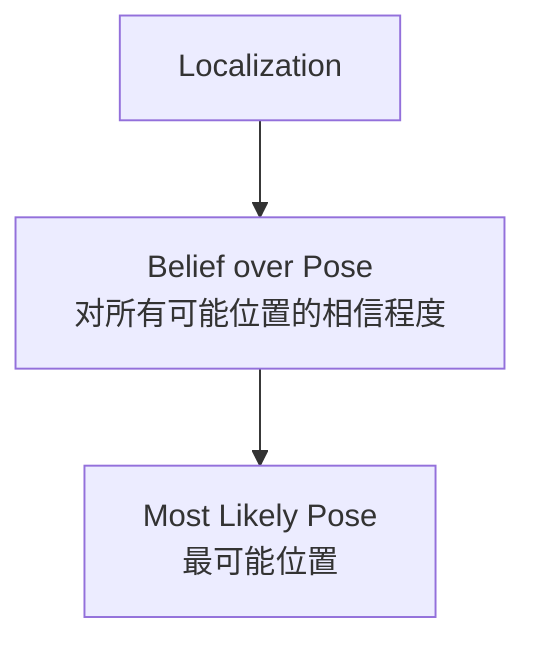
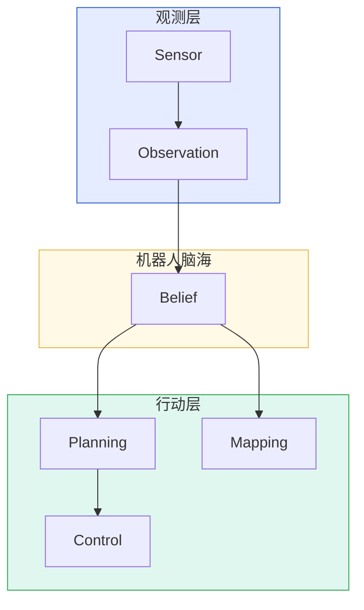
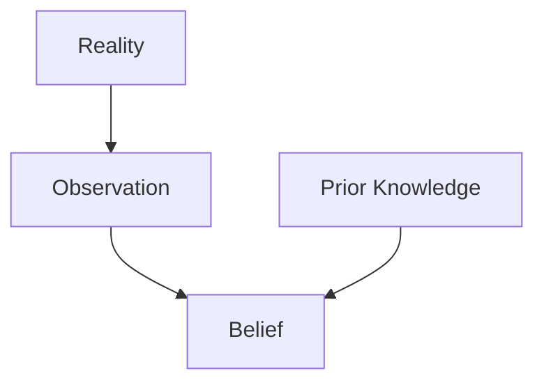

# 用分布表达位置

> 阅读定位：本部分以直觉和问题拆解为主。涉及具体滤波公式时，应同时确认模型、噪声和独立性假设；严格推导将随 Part II 整理补充。

## 本章目标

本章回答：

> 为什么机器人不能只维护一个位置 `(x, y, theta)`？

真正理解这一章后，再看 Kalman Filter、Particle Filter、Bayes Filter 和 Graph SLAM，就会知道它们维护的不是一个孤立位置，而是 Belief。

***

## 本章位置

Chapter 3 引入 `Belief`。Chapter 4 把它应用到 Localization：



位置只是 Belief 的一个读数，真正被维护的是 Belief 本身。

***

## 核心问题

### 为什么不是保存一个点？

两个机器人都可能输出：

```
(3.2, 5.1)
```

但一个可能误差 `±1cm`，另一个可能误差 `±3m`。如果只保存位置点，机器人不知道自己“有多确定”。

所以机器人必须同时保存：

```
位置 + 相信程度
```

这就是概率机器人学真正开始的地方。

***

## 正文

### 1. Localization 不是维护位置，而是维护位置的相信程度

机器人永远不可能确定自己精确位于：

```
x = 3.215486
y = 5.192384
theta = 27.413°
```

因为所有 Observation 都有误差。机器人真正知道的是：

> 我大概在这里，并且我对这个判断有某种相信程度。

### 2. 长廊思想实验

如果机器人在一条重复长廊中观察左右墙壁：

```
□□□□□□□□□□□□□□□□□□□□□□
机器人？
```

相同的 Observation 可能对应多个真实位置。机器人不能只保存一个点，而应保存多个可能位置及其概率。

这就是多峰 Belief 的直觉来源。

### 3. Belief 是机器人脑海里的世界模型

教材常说 Belief 是 Probability Distribution。更直观地说：

> Belief = 机器人脑海里的世界模型。

人闭眼时也不会精确知道卧室门的毫米级位置，只会有一个大致位置和不确定性。机器人也是如此。

### 4. Planning 也基于 Belief

Planning 不是根据 Reality 规划，而是根据 Belief 规划：



机器人永远活在自己的 Belief 中。Belief 错了，Planning 再精妙也会基于错误世界行动。

### 5. Prior Knowledge 也会更新 Belief

Belief 不只由 Observation 更新，还会受 Prior Knowledge 影响。



例如 Camera 看到“一条鱼”，机器人不会认为鱼在天上，因为它有“鱼通常不在天空中”的先验知识。

***

## 关键直觉

### 1. Localization 输出的不是 Pose，而是 Belief over Pose

很多工程接口会输出一个 Pose，但严格来说，那只是 Belief 中最可能的读数。

真正重要的是：

> Localization 输出 Belief over Pose。

### 2. Belief 越多越好吗？

不一定。

| Belief 数量 | 优点             | 缺点        |
| --------- | -------------- | --------- |
| 少         | 快、稳定、计算少       | 容易过早下结论   |
| 多         | 表达能力强、不容易错过可能性 | 计算爆炸、管理困难 |

这会引出 Hypothesis Management：机器人到底应该保留多少种可能解释？

### 3. 算法只是 Belief 的不同表达

| 方法              | Belief 表达方式 |
| --------------- | ----------- |
| Kalman Filter   | 均值 + 协方差    |
| Particle Filter | 一组粒子        |
| Graph SLAM      | 图上的联合概率关系   |

它们看起来不同，但本质上都在维护对状态的相信程度。

***

## 学习中的问题

<details>

<summary>Q1：如果机器人维护多个 Belief，会不会需要更多先验知识？</summary>

更准确地说，维护更多 Belief 需要更好的 Belief Management。

Prior Knowledge 可以帮助评价不同假设，但真正困难的是决定：

* 哪些 Belief 保留？
* 哪些 Belief 删除？
* 什么时候合并或分裂假设？

这是 SLAM、自动驾驶、目标跟踪中都存在的问题。

</details>

<details>

<summary>Q2：Belief 是不是越完整越好？</summary>

不是。Belief 越完整，计算成本越高；Belief 越简单，风险越大。机器人系统设计永远在“表达能力”和“计算可行性”之间取舍。

***

</details>

## 本章小结

1. Localization 维护的不是单个位置，而是对所有可能位置的相信程度。
2. 位置只是 Belief 的一个读数。
3. Planning、Mapping、Control 都基于 Belief，而不是直接基于 Reality。
4. Observation 和 Prior Knowledge 共同影响 Belief。
5. 机器人算法的差异，很多时候是 Belief 表达方式的差异。

***

## 课后任务

1. 解释为什么 `(3.2, 5.1)` 这个位置点本身不够。
2. 举一个“相同 Observation 对应多个可能 State”的例子。
3. 思考：如果机器人保留太多可能位置，会带来什么工程问题？

***

## 下一章

[Week 1 Chapter 5：贝叶斯思想到底是什么？](bayesian-thinking.md)

下一章开始讨论 Belief 如何被新的 Observation 合理更新。

## 相关笔记

* [Week 1 Chapter 3：如果机器人不能相信任何一个传感器，它到底应该相信谁？](observation-and-belief.md)
* 可后续沉淀概念：Belief over Pose、Probability Distribution、Hypothesis Management、Kalman Filter
