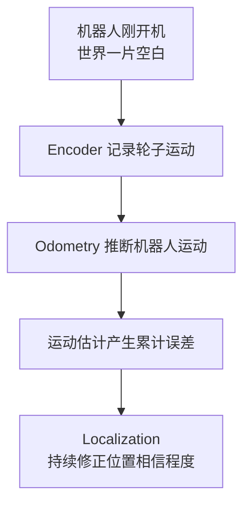
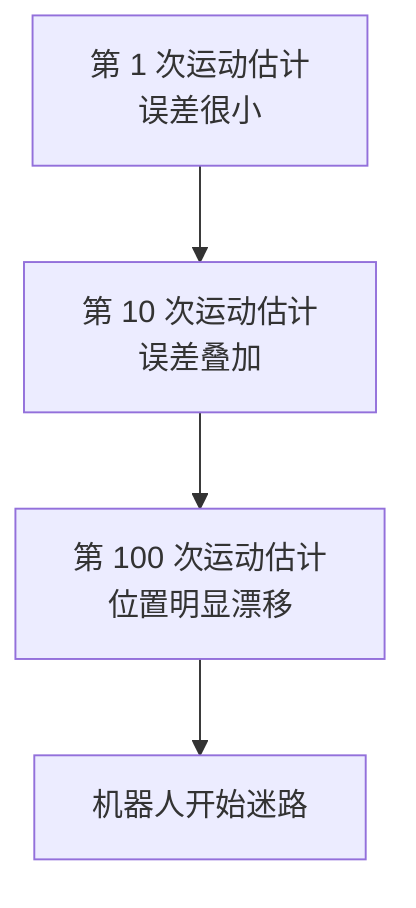
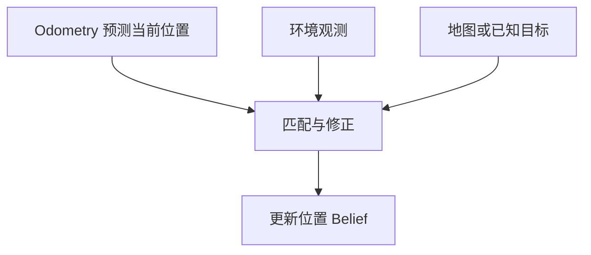

# 里程计与定位漂移

> 阅读定位：本部分以直觉和问题拆解为主。涉及具体滤波公式时，应同时确认模型、噪声和独立性假设；严格推导将随 Part II 整理补充。

## 本章目标

本章进入机器人定位（Localization）的起点：

> 为什么机器人需要 Localization？

很多教材会直接说“Localization 就是估计机器人位姿”，但真正重要的问题是：为什么机器人必须持续估计和修正自己的位置？

***

## 本章位置

Chapter 1 建立了机器人软件的信息流。Chapter 2 开始解释 `Localization` 为什么会出现。



后续里程计、IMU、ICP、视觉里程计、卡尔曼滤波和 SLAM，都可以看成是在回答同一个问题：

> 当运动估计不断积累误差时，机器人如何利用新信息把误差压回去？

***

## 核心问题

### 机器人刚开机时知道自己在哪里吗？

不知道。机器人内存里只有程序，没有“我在某个家中客厅”“厨房在左边”“沙发在前面”这些世界知识。

对机器人来说，世界一开始是一片空白。它必须依靠传感器，一点一点认识世界。

### Encoder 真正测量的是什么？

Encoder 不直接测量机器人走了多远，它测量的是：

> 轮子转了多少。

例如轮子半径 `r = 5 cm`，周长约为：

```
2πr ≈ 31.4 cm
```

如果 Encoder 记录轮子转了 `3` 圈，机器人会推断：

```
3 × 31.4 ≈ 94.2 cm
```

这里已经出现机器人学的核心思想：

> 机器人测到的东西很少，推断的东西很多。

***

## 正文

### 1. 机器人为什么会相信 Encoder

机器人把“轮子转了 94 cm”推成“机器人前进了 94 cm”，背后默认了一个假设：

> 轮子没有打滑，地面接触可靠，轮子运动能代表机体运动。

这不是事实，而是模型假设。

一旦轮子打滑，Encoder 仍然可能报告“轮子转了 1m”，但机器人真实只走了 `0.8m`。此时机器人内部位置和真实位置开始分离。

### 2. 误差为什么会累积

运动估计的误差不会自动消失。一次误差可能很小，但连续运行后会不断叠加：



这就是 Odometry 漂移。严格说：

> Odometry 会不断积累误差，而 SLAM 正是在不断压制和修正这种误差。

### 3. Camera / LiDAR 为什么不是“万能答案”

加入 Camera 或 LiDAR 不是让问题消失，而是引入新的信息源。

Camera 会受光照、纹理、遮挡影响；LiDAR 会受材质、玻璃、反射、几何退化影响；IMU 会有噪声和 Bias；Encoder 会受打滑影响。

所以机器人不是从“相信 Encoder”切换到“相信 Camera”，而是进入更深的问题：

> 既然每个传感器都会骗人，机器人怎样尽可能接近真实世界？

这会自然引出 Chapter 3 的 Information Fusion。

### 4. Localization 的真正定义

比“估计位姿”更贴近本质的定义是：

> Localization = 根据所有能够获得的信息，不断修正自己对于位置的相信程度。

这里没有说“找到真实位置”。机器人永远无法直接访问真实位置，它只能越来越相信：

```
我大概率在这里。
```

因此，Localization 从一开始就是一个不确定性问题。

***

## 关键直觉

### 1. 运动估计是推断，不是直接测量

Encoder 测到的是轮子运动，机器人的位姿是根据模型推断出来的。Camera、LiDAR、IMU 也类似：它们给出观测，机器人再根据模型解释观测。

### 2. Localization 不是寻找精确位置

机器人更像人在黑暗中摸索：它不一定知道自己距离门口正好 `32.5 cm`，但会维护一种“我应该快到门口了”的相信程度。

> Localization 不是寻找一个精确的位置，而是在不确定性中不断缩小自己对位置的怀疑。

### 3. 机器人是实时信息融合系统

从本章开始，机器人不再只是“机器”，而更像：

> Robot = Information Fusion System。

Encoder、Camera、LiDAR、IMU 都是在提供不同来源的信息。机器人真正做的是持续融合这些信息，让自己的 Belief 更接近可行动的世界模型。

***

## 学习中的问题

<details>

<summary>Q1：Encoder 有累计误差，为什么现实中的扫地机器人还能工作一小时并回充？</summary>

因为机器人不会只依赖 Encoder。它会通过环境特征、地图匹配、回环检测、充电座识别等方式，把当前观测和已有地图或目标进行匹配，从而修正之前积累的运动误差。

可以先粗略理解为：



</details>

<details>

<summary>Q2：如果有完美 Encoder，SLAM 还会存在吗？</summary>

完美 Encoder 可以极大削弱 Localization 的漂移问题，但不等于解决 Mapping。

机器人仍然需要回答：

* 世界里有什么？
* 墙、桌子、门、障碍物在哪里？
* 地图如何建立和更新？
* 环境是否发生变化？

所以“完美运动估计”不能替代“理解环境”。SLAM 的 Localization 部分可能变得简单，但 Mapping 和环境理解仍然存在。

***

</details>

## 本章小结

1. Encoder 测量的是轮子的运动，不是机器人本体的真实运动。
2. 机器人的位置来自推断，而不是直接测量。
3. Odometry 会不可避免地产生累计误差。
4. Localization 的目标不是找到绝对真值，而是不断利用新信息修正位置 Belief。
5. 机器人技术的发展不是凭空发明算法，而是一个问题催生下一个问题。

***

## 课后任务

1. 用自己的语言解释：为什么 Encoder 测量准确，也不等于机器人位置准确？
2. 思考：除了 Encoder，哪些传感器或环境信息可以帮助机器人把累计误差压下去？
3. 区分：Odometry、Localization、SLAM 三者分别在解决什么问题？

***

## 下一章

[Week 1 Chapter 3：如果机器人不能相信任何一个传感器，它到底应该相信谁？](observation-and-belief.md)

下一章进入现代机器人学的核心问题：所有传感器都会骗人时，机器人怎样融合信息并维护自己的 Belief？

## 相关笔记

* [Week 1 Chapter 1：机器人到底是什么？](robot-systems.md)
* 可后续沉淀概念：Odometry、Encoder、IMU、Coordinate Frame、Localization
