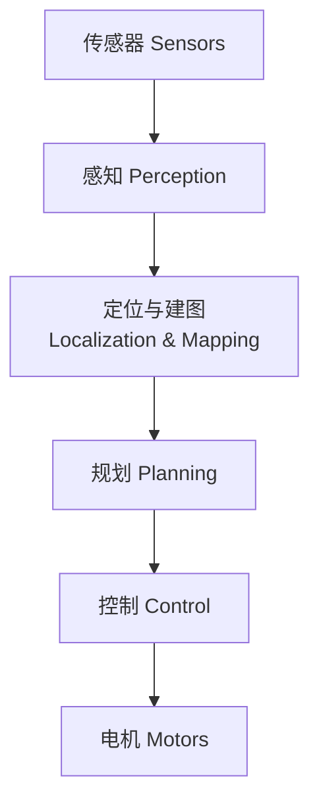
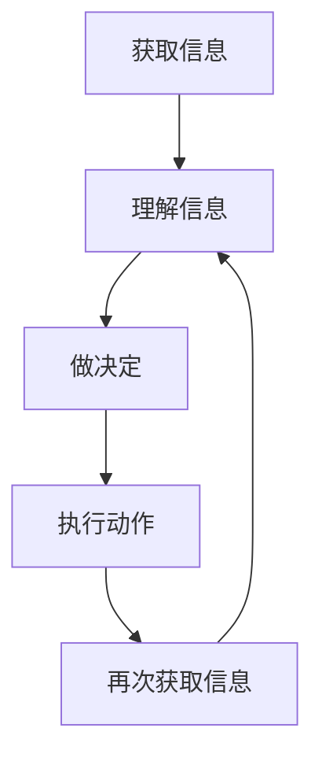
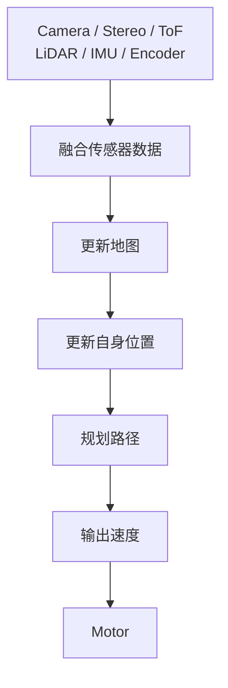
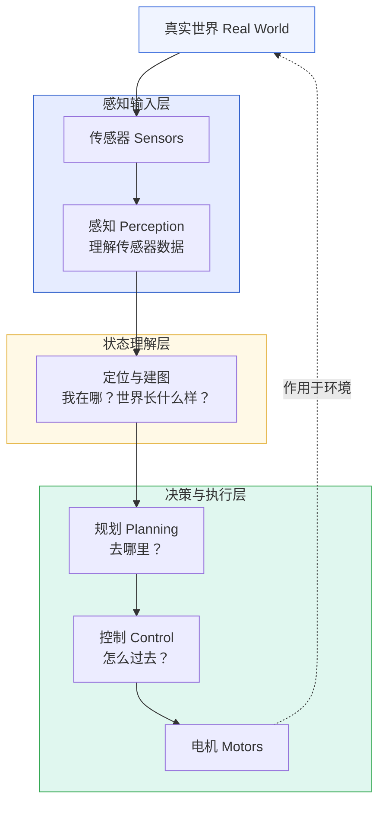
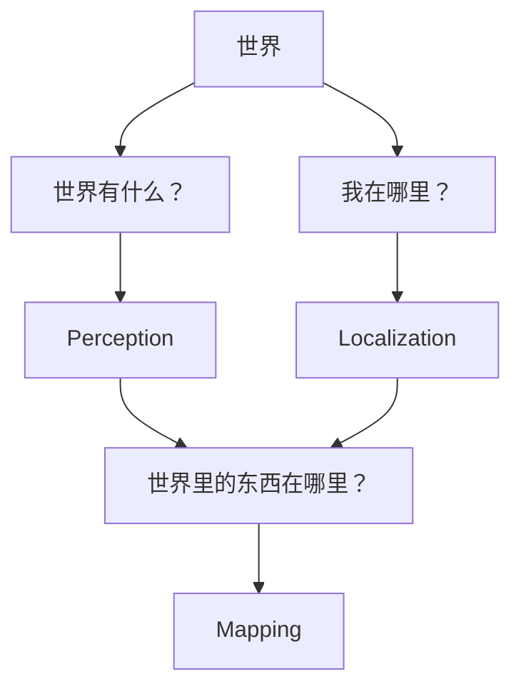

# 机器人系统的信息流

> 阅读定位：本部分以直觉和问题拆解为主。涉及具体滤波公式时，应同时确认模型、噪声和独立性假设；严格推导将随 Part II 整理补充。

## 本章目标

学习 SLAM 不能一开始就陷入 EKF、ICP、Pose Graph 这些孤立算法。第一章先建立更大的机器人系统视角：

> 机器人不是某个算法，也不只是会动的机器，而是一个持续感知、理解、决策和执行的实时信息处理系统。

本章要回答三个问题：

* 机器人到底在处理什么？
* 传感器、感知、定位、建图、规划、控制之间是什么关系？
* SLAM 在机器人软件系统中处于什么位置？

***

## 本章位置

本章是整个 `Robot Perception & SLAM` 课程的入口。

这一章不深入讲 SLAM 算法，而是先给所有后续知识找到位置：



以后学到的算法都可以先放回这条信息流中理解：

| 算法 / 模块        | 所属位置         |
| -------------- | ------------ |
| 地面检测、目标识别      | Perception   |
| ICP、里程计、定位滤波   | Localization |
| 栅格地图、点云地图、语义地图 | Mapping      |
| A\*、路径搜索       | Planning     |
| PID、轨迹跟踪       | Control      |

***

## 核心问题

### 机器人是不是只是“接收命令，然后运动”？

不是。

机器人真正长期运行的是一个信息闭环：



电机控制只是一部分。绝大多数时间里，机器人都在持续处理来自 Camera、Stereo、ToF、LiDAR、IMU、Encoder 等传感器的数据。

例如扫地机器人每隔几十毫秒都会循环：



这个循环可能以 `20Hz`、`50Hz` 甚至 `100Hz` 运行。

***

## 正文

### 1. 机器人是实时信息处理系统

扫地机器人、无人机、机械臂、自动驾驶、配送机器人、四足机器人和人形机器人看起来差异很大，但它们的软件结构有相似的底层逻辑。

机器人开始工作时，并不知道：

```
我在哪？
房间多大？
哪里有墙？
哪里有桌子？
哪里扫过？
哪里没扫？
```

所以机器人第一件事不是“行动”，而是获取信息。没有信息，运动只是盲目执行。

### 2. 传感器是机器人认识世界的唯一窗口

本章最重要的一句话：

> 机器人永远接触不到真实世界，只能接触到传感器输出。

不同传感器输出的是不同形式的数据：

| 传感器     | 输出                             |
| ------- | ------------------------------ |
| Camera  | RGB Image                      |
| LiDAR   | Point Cloud                    |
| Stereo  | Depth / Disparity              |
| IMU     | Acceleration, Angular Velocity |
| Encoder | Wheel Rotation                 |

机器人真正“看到”的不是桌子、沙发或人，而是像素、点云、深度、角速度、轮速这些数字。算法的任务是把这些数字转化为对世界的理解。

因此，机器人感知可以先粗略理解为：

> 如何把传感器数字变成可用于行动的世界理解。

### 3. 机器人软件的信息流

机器人软件可以抽象为：



这张图是后续课程的总地图。SLAM 不是机器人全部，而是连接“理解世界”和“行动”的关键模块之一。

### 4. 为什么机器人需要 Localization

假设机器人只有 Encoder。它向前运动 `1m`，Encoder 告诉它：

```
Forward 1m
```

机器人会相信自己到了：

```
(1.0, 0)
```

但如果轮子打滑，真实位置可能只有：

```
(0.8, 0)
```

机器人如果没有外部观测，就不知道这个误差。继续执行 100 次以后，误差会不断累积。

所以机器人必须不断问自己：

> 我真的在这里吗？

这个问题就是 Localization。

### 5. 为什么 Mapping 会一起出现

即使机器人知道自己在 `(2, 3)`，它仍然不知道：

```
墙在哪？
桌子在哪？
房间多大？
```

所以机器人还需要建立地图。于是机器人同时面对两个问题：

```
我在哪？
世界长什么样？
```

这就是 SLAM 的入口：Simultaneous Localization and Mapping，同时定位与建图。

***

## 关键直觉

### 1. 机器人不直接认识“物体”，只处理传感器数据

人看到“桌子”时，也不是大脑直接接触桌子，而是接收光信号经过视觉系统处理后的结果。机器人也类似，只是它的传感器是 Camera、LiDAR、IMU 等。

这能帮助理解后续的 Feature、Descriptor、CNN、Transformer、多传感器融合：它们都在回答同一个大问题：

> 如何从观测信号中恢复对世界的理解？

### 2. 只会执行动作不是智能，能检查动作才形成闭环

只有 Encoder 的机器人仍然可以执行：

```
前进 2m
左转 90°
再前进 1m
```

但它不知道：

```
真的到了吗？
撞墙了吗？
打滑了吗？
房间里有没有桌子？
```

这就是开环与闭环的区别：

| 方式          | 含义                  |
| ----------- | ------------------- |
| Open Loop   | 相信动作被正确执行，不根据外部反馈修正 |
| Closed Loop | 执行动作后持续观测，并根据反馈修正   |

后续 Camera、LiDAR、IMU 等传感器加入后，机器人开始不断检查“我真的做对了吗”。这就是 Feedback，也是控制、SLAM 和机器人系统的核心思想之一。

### 3. 感知、定位、建图分别回答三个问题

机器人感知系统可以先用三个问题来区分：

| 问题         | 模块           | 示例输出                      |
| ---------- | ------------ | ------------------------- |
| 世界里面有什么？   | Perception   | 人、桌子、椅子、墙、地面、障碍物          |
| 我在哪里？      | Localization | `x`, `y`, `theta`         |
| 世界里的东西在哪里？ | Mapping      | 墙在 `(10, 5)`，桌子在 `(3, 2)` |

对应关系：



***

## 学习中的问题

<details>

<summary>Q1：为什么说机器人永远接触不到真实世界，只能接触到传感器？</summary>

因为机器人和世界的交互必须经过传感器。Camera 给它像素，LiDAR 给它点云，IMU 给它加速度和角速度，Encoder 给它轮子转动。

更进一步看，任何智能体都不是直接接触世界，而是接收某种观测信号，再在内部形成解释。机器人感知，本质上就是把传感器信号解释成世界模型。

</details>

<details>

<summary>Q2：如果扫地机器人没有 Camera、LiDAR、ToF，只有 Encoder，还能做什么？</summary>

它仍然能执行预设运动，例如前进、转弯、按固定路径移动。

但它做不到可靠地确认：

* 是否真的走到目标位置
* 是否发生打滑
* 是否撞墙
* 周围是否有桌子、墙或障碍物

所以只有 Encoder 的机器人可以运动，但很难可靠地理解环境，也很难长期保持准确位置。

</details>

<details>

<summary>Q3：Perception 和 Localization 的本质区别是什么？</summary>

Perception 回答“世界里面有什么”，例如检测到桌子、墙、地面或障碍物。

Localization 回答“我在哪里”，例如估计机器人当前的 `(x, y, theta)`。

如果机器人进一步回答“桌子在地图上的 `(5, 8)`”，它已经进入 Mapping：把世界中的对象放进地图坐标中。

***

</details>

## 本章小结

本章最重要的不是记住术语，而是建立机器人系统世界观：

1. 机器人不是在简单运动，而是在持续处理信息。
2. 传感器是机器人认识世界的唯一窗口。
3. 机器人软件可以看成信息流：传感器 -> 感知 -> 定位与建图 -> 规划 -> 控制。
4. SLAM 不是机器人全部，它是机器人在未知环境中同时回答“我在哪”和“世界长什么样”的关键能力。

以后看到任何机器人算法，都先问三个问题：

* 它解决的是“世界有什么”、“我在哪”，还是“它们在哪里”？
* 它的输入是什么？输出是什么？
* 它为什么会被发明？解决了上一代方法的什么问题？

***

## 课后任务

不用查资料，尝试用自己的语言回答：

1. 为什么机器人只能接触传感器，而不能直接接触真实世界？
2. 一个只有 Encoder、没有 Camera / LiDAR / ToF 的扫地机器人，能完成哪些事？哪些事一定做不到？
3. Perception、Localization、Mapping 三者的区别是什么？

***

## 下一章

[Week 1 Chapter 2：机器人为什么会迷路？](odometry-and-drift.md)

下一章从最简单的轮式机器人开始，讨论：

* 为什么只靠轮子也能估计位置？
* 为什么这种估计一定会产生误差？
* 误差是如何累积的？
* 为什么这个问题催生了 Localization，并最终引出 SLAM？

## 相关笔记

* [SLAM 自学](../)
* 可后续沉淀概念：Coordinate Frame、Occupancy Grid、Perception、Localization、Mapping
